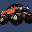

# 4 Wheel Thunder

## VMU Saves

| Icon | Filename | VMI | VMS | Description |
|------|----------|-----|-----|-------------|
|  | `4WHLTHNDR_BK` | [v77702.vmi](v77702.vmi) | [v77702.VMS](v77702.VMS) | all the cars and their cost. i even got all the toy cars  |
|  | `4WHLTHNDR_BK` | [v33294.vmi](v33294.vmi) | [v33294.VMS](v33294.VMS) | 4 wheel thunder every vehicle,every upgrade & every track  |
|  | `4WHLTHNDR_BK` | [v30471.vmi](v30471.vmi) | [v30471.VMS](v30471.VMS) | few upgrades and a few extra vehicles. |
|  | `4WHLTHNDR_BK` | [4WHEEL.VMI](4WHEEL.VMI) | [4WHEEL.VMS](4WHEEL.VMS) | All unlocked. |
