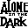

# Alone in the Dark: The New Nightmare

## VMU Saves

| Icon | Filename | VMI | VMS | Description |
|------|----------|-----|-----|-------------|
|  | `_ALONE4_.000` | [v66414.vmi](v66414.vmi) | [v66414.VMS](v66414.VMS) | Middle of 1st disk lots of ammo and helth  |
|  | `_Alone4_.000` | [v9840.vmi](v9840.vmi) | [v9840.VMS](v9840.VMS) | This is very hacked save with all guns and 999 ammo and all items available!!! What else do you want?NOTE:DON'T RELOAD THE GUNS WITH 999 AMMO.  |
|  | `_ALONE4_.000` | [v84284.vmi](v84284.vmi) | [v84284.VMS](v84284.VMS) | Alone in the DarkThe new nightmareStuck at the library control board!  |
|  | `_Alone4_.000` | [v65834.vmi](v65834.vmi) | [v65834.VMS](v65834.VMS) | start game with all weapons and items  |
|  | `_Alone4_.000` | [v83379.vmi](v83379.vmi) | [v83379.VMS](v83379.VMS) | just ending of disc 1  |
|  | `_Alone4_.000` | [v33710.vmi](v33710.vmi) | [v33710.VMS](v33710.VMS) | good 100% game completed  |
|  | `_ALONE4_.000` | [v51789.vmi](v51789.vmi) | [v51789.VMS](v51789.VMS) | Is that timer pissing you off? This save starts you off right after the wall to the caves of darkness gets blown wide open. Got tons o save charms, all weapons, not much ammo though. But there's lots of crystals in the caves to recharge your sh |
|  | `_Alone4_.000` | [v85699.vmi](v85699.vmi) | [v85699.VMS](v85699.VMS) | save game  ////  mansion//  100% arms.  |
|  | `_ALONE4_.000` | [v12303.vmi](v12303.vmi) | [v12303.VMS](v12303.VMS) | This save is with Carnby in the Library.Get ready to fight a bad flying boss.I have most of the doors in the house unlocked.I am really low on ammo on this save,so good luck ifyou decide try this save.  |
|  | `_ALONE4_.000` | [v58587.vmi](v58587.vmi) | [v58587.VMS](v58587.VMS) | half way done on disk 1  still, i'm playing with the chicka  |
|  | `_ALONE4_.001` | [v22685.vmi](v22685.vmi) | [v22685.VMS](v22685.VMS) | aline at last boss  |
|  | `_ALONE4_.000` | [ALONE4.VMI](ALONE4.VMI) | [ALONE4.VMS](ALONE4.VMS) | Last Save! at disc 2! |
|  | `_Alone4_.000` | [AITDA1.VMI](AITDA1.VMI) | [AITDA1.VMS](AITDA1.VMS) | Aline at end of 1st disc. |
|  | `_Alone4_.001` | [AITDA2.VMI](AITDA2.VMI) | [AITDA2.VMS](AITDA2.VMS) | Aline at half of 2nd disc. |
|  | `_Alone4_.005` | [AITDC1.VMI](AITDC1.VMI) | [AITDC1.VMS](AITDC1.VMS) | Carnby at end of 1st disc. |
