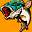

# Sega Bass Fishing 2

## VMU Saves

| Icon | Filename | VMI | VMS | Description |
|------|----------|-----|-----|-------------|
|  | `BASSFISHING2` | [v40328.vmi](v40328.vmi) | [v40328.VMS](v40328.VMS) | Completo, todas as iscas, todas as cores,todos os torneios em primeiro lugar, todospersonagens.  |
|  | `BASSFISHING2` | [v41303.vmi](v41303.vmi) | [v41303.VMS](v41303.VMS) | Completissimo.  |
|  | `BASSFISHING2` | [v88108.vmi](v88108.vmi) | [v88108.VMS](v88108.VMS) | I have beated the game.I Got 90 lures,12 togo  |
|  | `BASSFISHING2` | [v32382.vmi](v32382.vmi) | [v32382.VMS](v32382.VMS) | All tourney's beaten, all charatersgained. Only a few lures left to get.   |
|  | `BASSFISHING2` | [v19323.vmi](v19323.vmi) | [v19323.VMS](v19323.VMS) | Fourth stage of pro tourny. Only a couple lures left, all chars unlocked.  |
|  | `BASSFISHING2` | [v46495.vmi](v46495.vmi) | [v46495.VMS](v46495.VMS) | Im in the 3rd tournament and unlockedlots of lures and colors and 2 xtra characters.            |
|  | `BASSFISHING2` | [v99176.vmi](v99176.vmi) | [v99176.VMS](v99176.VMS) | The first tournament has beenbeaten with all first placeand biggest fish awards.Openedsome lures and one secret guy.  |
|  | `GETBASS2DATA` | [bass2jp1.VMI](bass2jp1.VMI) | [bass2jp1.VMS](bass2jp1.VMS) | Good save for Bass Fishing 2! (Jap) |
|  | `BASSFISHING2` | [SBASSF2.VMI](SBASSF2.VMI) | [SBASSF2.VMS](SBASSF2.VMS) | Almost all unlocked. |
