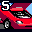

# Daytona USA

## VMU Saves

| Icon | Filename | VMI | VMS | Description |
|------|----------|-----|-----|-------------|
|  | `DAYTONA__CNF` | [v5692.vmi](v5692.vmi) | [v5692.VMS](v5692.VMS) | Intermediate save for the japaneseversion.Two extra cars,and good lap times.All tracksunlocked.  |
|  | `DAYTONA__CNF` | [v58535.vmi](v58535.vmi) | [v58535.VMS](v58535.VMS) | Brasileiros o Dreamcast detona.Esse save tem todos os carros, cores legais no custon e a melhor configuracao para os controles  |
|  | `DAYTONA__CNF` | [v57953.vmi](v57953.vmi) | [v57953.VMS](v57953.VMS) |  You want all cars to play online?Now you can!Download this save to have ALL CARS!!!  |
|  | `DAYTONA__CNF` | [v84127.vmi](v84127.vmi) | [v84127.VMS](v84127.VMS) | All cars,the best calibrationcomplete, all circuits.  |
|  | `DAYTONA__CNF` | [v49059.vmi](v49059.vmi) | [v49059.VMS](v49059.VMS) | This save has almost all thecars. Im missing the net battlecar and uma the horse. I have played for 67 hrs you need 100 hrs to get the net battlecar.  |
|  | `DAYTONA__CNF` | [v42830.vmi](v42830.vmi) | [v42830.VMS](v42830.VMS) | This is for all the impatient begginers out there, and online competitors alike! This file has all cars except 100hours car, 37 hours currently, you'll get it eventually!It also has the nations current fastest ghost to practice with too on dino |
|  | `DAYTONA__CNF` | [v24536.vmi](v24536.vmi) | [v24536.VMS](v24536.VMS) | 4 cars unlocked (red cat,unicorn,pywacket&pywacket super).  |
|  | `DAYTONA__CNF` | [v78651.vmi](v78651.vmi) | [v78651.VMS](v78651.VMS) | First two cars (Unicorn and Barchetta) unlocked. Custom color 1 for each car uses the Hornet scheme, color 3 is all black.  |
|  | `DAYTONA__CNF` | [v48733.vmi](v48733.vmi) | [v48733.VMS](v48733.VMS) | One car won in championship,the unicorn carstats:grip=35,accel+speed=90,max speed=227mph.  |
|  | `DAYTONA__CNF` | [v13379.vmi](v13379.vmi) | [v13379.VMS](v13379.VMS) | [Japanese] ALL UNLOCKED.  |
|  | `DAYTONA__CNF` | [v77273.vmi](v77273.vmi) | [v77273.VMS](v77273.VMS) | [Japanese] Two news cars and a high score.  |
|  | `DAYTONA__CNF` | [dusa2001.VMI](dusa2001.VMI) | [dusa2001.VMS](dusa2001.VMS) | Perfect Save |
