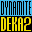

# Dynamite Cop

## VMU Saves

| Icon | Filename | VMI | VMS | Description |
|------|----------|-----|-----|-------------|
|  | `D_COP_US.REC` | [v38473.vmi](v38473.vmi) | [v38473.VMS](v38473.VMS) | The best save, with everything unlocked, including illustrations , characters,  and missions.  |
|  | `D_COP_US.REC` | [v65817.vmi](v65817.vmi) | [v65817.VMS](v65817.VMS) | All 6 missions finished,good bonus game score,and all illustrations found. All characters unlocked.  |
|  | `D_COP_PL.REC` | [v18467.vmi](v18467.vmi) | [v18467.VMS](v18467.VMS) | [ImportCase file, unlocked missions 4,5,6. Completed missions 4,5.R Rare file! (5 blocks) without Detonator pack.  |
|  | `D_COP_US.TRI` | [v99721.vmi](v99721.vmi) | [v99721.VMS](v99721.VMS) | All levels unlocked, characters found, pictures located, and extra modes cleared, including the insanely hard 100 enemy kitchen brawl which took 5 years off of my life.  |
|  | `D_COP_US.REC` | [v99226.vmi](v99226.vmi) | [v99226.VMS](v99226.VMS) | Every mission completed. Cindy & Originial Bruno from Die Hard Arcade unlocked. Super Detenator Pack added as well.NOTE:THERE IS NO MONKEY!!  |
|  | `D_COP_US.REC` | [v78278.vmi](v78278.vmi) | [v78278.VMS](v78278.VMS) | Perfect save. Combat file with allpictures found and all missions beat including 4,5,& 6. Two secretchars unlocked . I don't think thereis a secret monkey char. Could'nt find it even with mission 6 com-pleted, the most frustrating impossible le |
|  | `D_COP_US.REC` | [v92082.vmi](v92082.vmi) | [v92082.VMS](v92082.VMS) | All artwork unlocked, Cindy and alternate Bruno unlocked. Just play through missions 4 to 6 to unlock the monkey.  |
|  | `D_COP_US.REC` | [v26274.vmi](v26274.vmi) | [v26274.VMS](v26274.VMS) | Combat File & Missions 1 & 3 are completed.  |
|  | `D_COP_US.REC` | [00000728.vmi](00000728.vmi) | [00000728.VMS](00000728.VMS) | Dynamite Cop "Combat File" with detonator pack and mission #1 completed.  |
|  | `DDEKA2DC.REC` | [kuaida2.VMI](kuaida2.VMI) | [kuaida2.VMS](kuaida2.VMS) | Perfect Save! Everything Unlocked! |
|  | `D_COP_US.TRI` | [DET_PACK.VMI](DET_PACK.VMI) | [DET_PACK.VMS](DET_PACK.VMS) | Dynamite Cop Detonator Pack. |
