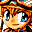

# Evolution

## VMU Saves

| Icon | Filename | VMI | VMS | Description |
|------|----------|-----|-----|-------------|
|  | `EVO_DATA.003` | [v77140.vmi](v77140.vmi) | [v77140.VMS](v77140.VMS) | Finished lots of rare items skills complete lvl.99 characters both debts paid 100% comp.  |
|  | `EVO_DATA.001` | [v92335.vmi](v92335.vmi) | [v92335.VMS](v92335.VMS) | second time thru the game, everything at 999 I swear.  |
|  | `EVO_DATA.001` | [v96083.vmi](v96083.vmi) | [v96083.VMS](v96083.VMS) | Game completed with 500,000 dollars, level 99 characters, and debt paidoff.  |
|  | `EVO_DATA.000` | [v30167.vmi](v30167.vmi) | [v30167.VMS](v30167.VMS) | All ruins cleared and initial debt payed off. Characters are in the 80 range, and have a good deal of Green Moss and Apple Grass.  |
|  | `EVO_DATA.001` | [v8206.vmi](v8206.vmi) | [v8206.VMS](v8206.VMS) | Last battle with Robo Eugene, Everyone at level 99 Download and destroy everything!  |
|  | `EVO_DATA.001` | [v74072.vmi](v74072.vmi) | [v74072.VMS](v74072.VMS) | First Ruin done after completion of the game the first time. Plus your debt paid off plus some pretty powerful weapons.  |
|  | `EVO_DATA.001` | [v49616.vmi](v49616.vmi) | [v49616.VMS](v49616.VMS) | All ruins cleared. All Ruins open.Done with hardwork. Characters arearound lv. 50  |
|  | `EVO_DATA.001` | [v81894.vmi](v81894.vmi) | [v81894.VMS](v81894.VMS) | At the final battle with robot eugene.  |
|  | `EVO_DATA.002` | [v96215.vmi](v96215.vmi) | [v96215.VMS](v96215.VMS) | This a hacked saved file this save gives you level 99 and maxed stats and loads of cash this is at the very first of the game your debt has already been payed off and your asignment has been picked.  |
|  | `EVO_DATA.001` | [v69147.vmi](v69147.vmi) | [v69147.VMS](v69147.VMS) | Beginning of game after 1st battle all charachters will be on level 99 with all stats maxed out!  |
|  | `EVO_DATA.001` | [v47072.vmi](v47072.vmi) | [v47072.VMS](v47072.VMS) | 3rd dungeon, everyone level 55 or higher  |
|  | `EVO_DATA.001` | [v94887.vmi](v94887.vmi) | [v94887.VMS](v94887.VMS) | This save is with the game cleared,with everyone at level 55 or higher.Only one more ruin to complete, the Heaven's Ruins!!!  |
|  | `EVO_DATA.001` | [v99264.vmi](v99264.vmi) | [v99264.VMS](v99264.VMS) | the second dungeon is completed and everyone on level 20 or higher.  |
|  | `EVO_DATA.003` | [00000606.vmi](00000606.vmi) | [00000606.VMS](00000606.VMS) | 100% complete!  |
|  | `EVO_DATA.001` | [00000011.vmi](00000011.vmi) | [00000011.VMS](00000011.VMS) | Perfect Save! All Open! |
|  | `EVO_DATA.001` | [evolujp.VMI](evolujp.VMI) | [evolujp.VMS](evolujp.VMS) | Good save for Evolution! (Jap) |
