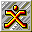

# Expendable

## VMU Saves

| Icon | Filename | VMI | VMS | Description |
|------|----------|-----|-----|-------------|
|  | `EXPENDAB.CFG` | [v68167.vmi](v68167.vmi) | [v68167.VMS](v68167.VMS) | THIS IS A SAVE AT THE 4th OR Solevel  |
|  | `EXPENDAB.001` | [v91860.vmi](v91860.vmi) | [v91860.VMS](v91860.VMS) | This will start you out at Level 21, the last level of the game. You'll be going against the final boss in the game as soon as you enter the level so get ready for a good fight.  |
|  | `EXPENDAB.001` | [v84324.vmi](v84324.vmi) | [v84324.VMS](v84324.VMS) | LAST LEVEL PLUS SUPER POWER ITEM  |
|  | `EXPENDAB.001` | [00000011.vmi](00000011.vmi) | [00000011.VMS](00000011.VMS) | This is a game save up to level 5 in the game.  |
