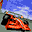

# Flag To Flag

## VMU Saves

| Icon | Filename | VMI | VMS | Description |
|------|----------|-----|-----|-------------|
|  | `SEGACART.SYS` | [v59453.vmi](v59453.vmi) | [v59453.VMS](v59453.VMS) | Todos los autos y el super speed mode.                 |
|  | `SEGACART.SYS` | [v81874.vmi](v81874.vmi) | [v81874.VMS](v81874.VMS) | its a start   |
|  | `SEGACART.SYS` | [v90922.vmi](v90922.vmi) | [v90922.VMS](v90922.VMS) | todos los varros y mas secretos  |
|  | `SEGACART.SYS` | [v54673.vmi](v54673.vmi) | [v54673.VMS](v54673.VMS) | Five extra cars, extra camera angle, Super Speed Mode(60fps)  |
|  | `SEGACART.SYS` | [v97020.vmi](v97020.vmi) | [v97020.VMS](v97020.VMS) | Won champ mode, Unlocked pace car and super fast race...Hey its not much, but its something for this game.....  |
|  | `SEGACART.SYS` | [v81960.vmi](v81960.vmi) | [v81960.VMS](v81960.VMS) | Todos los autos, y el super speed mode. Dudas:arcadelac@hotmail.com  |
|  | `SEGACART.SYS` | [v46911.vmi](v46911.vmi) | [v46911.VMS](v46911.VMS) | [Japanese] Everything completed.  |
