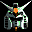

# Gundam Side Story 0079

## VMU Saves

| Icon | Filename | VMI | VMS | Description |
|------|----------|-----|-----|-------------|
|  | `GUNDAM_US_01` | [v71807.vmi](v71807.vmi) | [v71807.VMS](v71807.VMS) | All codes new suits for you and them  |
|  | `GUNDAM_US_01` | [v58359.vmi](v58359.vmi) | [v58359.VMS](v58359.VMS) | Each stat at 100% beat game  |
|  | `GUNDAM_US_01` | [v44953.vmi](v44953.vmi) | [v44953.VMS](v44953.VMS) | Beat the game. Opened cheat option  |
|  | `GUNDAM_SS1DL` | [v31604.vmi](v31604.vmi) | [v31604.VMS](v31604.VMS) | This will unlock all the extra options for 0079  |
|  | `GUNDAM_US_01` | [v79900.vmi](v79900.vmi) | [v79900.VMS](v79900.VMS) | the game is beat on all 3 difficulties with extra options  |
|  | `GUNDAM_US_01` | [v95962.vmi](v95962.vmi) | [v95962.VMS](v95962.VMS) | Everything beat, Extra options unlocked  |
|  | `GUNDAM_US_01` | [v92694.vmi](v92694.vmi) | [v92694.VMS](v92694.VMS) | All options and unbeatable scores.  |
|  | `GUNDAM_US_01` | [v84481.vmi](v84481.vmi) | [v84481.VMS](v84481.VMS) | Extra options available plus my 3 best levels.  |
|  | `GUNDAM_US_01` | [v958.vmi](v958.vmi) | [v958.VMS](v958.VMS) | Game beatten on hard. All special options available. The best stats possible.  |
|  | `GUNDAM_US_01` | [v93011.vmi](v93011.vmi) | [v93011.VMS](v93011.VMS) | ex. options /beaten 2 difficulties  |
|  | `GUNDAM_US_01` | [v11985.vmi](v11985.vmi) | [v11985.VMS](v11985.VMS) | beat on all difficulties and have special options[ on level 5 on hard mode without codes]  |
|  | `GUNDAM_US_01` | [v68457.vmi](v68457.vmi) | [v68457.VMS](v68457.VMS) | 3levels saved and special options.  |
|  | `GUNDAM_US_01` | [v61660.vmi](v61660.vmi) | [v61660.VMS](v61660.VMS) | beat it  |
|  | `GUNDAM_PD_01` | [GUNDAM1.VMI](GUNDAM1.VMI) | [GUNDAM1.VMS](GUNDAM1.VMS) | Good save for Gundam Side Story 0079! |
|  | `GUNDAM_SS1DL` | [GUNDAM2.VMI](GUNDAM2.VMI) | [GUNDAM2.VMS](GUNDAM2.VMS) | Good save for Gundam Side Story 0079! |
|  | `GUNDAM_SS_01` | [GUNDAM3.VMI](GUNDAM3.VMI) | [GUNDAM3.VMS](GUNDAM3.VMS) | Good save for Gundam Side Story 0079! |
|  | `GUNDAM_US_01` | [v67186.vmi](v67186.vmi) | [v67186.VMS](v67186.VMS) | This save contains all extra options, and yes they are very cool to play with. The game is won on easy, medium, and hard. Its pretty damn cool.  |
