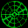

# Incoming

## VMU Saves

| Icon | Filename | VMI | VMS | Description |
|------|----------|-----|-----|-------------|
|  | `INCOMING.001` | [v30743.vmi](v30743.vmi) | [v30743.VMS](v30743.VMS) | this is a perfect save whit everithing done.All the 10 missions done.Tudo completo este e o save que todos procuram.  |
|  | `INCOMING.001` | [v19449.vmi](v19449.vmi) | [v19449.VMS](v19449.VMS) | This gets you to the third mission. I hope you find it helpful.  |
|  | `INCOMING.001` | [00000378.vmi](00000378.vmi) | [00000378.VMS](00000378.VMS) | SCENARIO 03 starts in scenario 3  |
