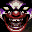

# KISS Psycho Circus: The Nightmare Child

## VMU Saves

| Icon | Filename | VMI | VMS | Description |
|------|----------|-----|-----|-------------|
|  | `TRMR_KPC.DAT` | [v18835.vmi](v18835.vmi) | [v18835.VMS](v18835.VMS) | In this save file, the wholegame is 100% complete. Allweapons, maximum health onall four charecters, and ofcourse, the last stage isbaeten. Have Fun!  |
|  | `TRMR_KPC.DAT` | [v95432.vmi](v95432.vmi) | [v95432.VMS](v95432.VMS) | 3 caracters unlocked and 2 stages beaton with the demon.  |
|  | `TRMR_KPC.DAT` | [v18475.vmi](v18475.vmi) | [v18475.VMS](v18475.VMS) | Done with star child halfway through beast king  |
|  | `TRMR_KPC.DAT` | [v64618.vmi](v64618.vmi) | [v64618.VMS](v64618.VMS) | All the levels and characters unlocked.  |
|  | `TRMR_KPC.DAT` | [v25392.vmi](v25392.vmi) | [v25392.VMS](v25392.VMS) | All characters complete. only have to complete the "nightmare" stage to win.  |
|  | `TRMR_KPC.DAT` | [v55188.vmi](v55188.vmi) | [v55188.VMS](v55188.VMS) | Completed star bearer, beast king, started on celestial.  |
|  | `TRMR_KPC.DAT` | [v15003.vmi](v15003.vmi) | [v15003.VMS](v15003.VMS) | Kiss psycho circus: all weapons for star child and beginnig on cat man   |
|  | `TRMR_KPC.DAT` | [KISSPC.VMI](KISSPC.VMI) | [KISSPC.VMS](KISSPC.VMS) | All stages. |
