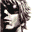

# The King Of Fighters 2000

## VMU Saves

| Icon | Filename | VMI | VMS | Description |
|------|----------|-----|-----|-------------|
|  | `KOF2000_0000` | [KOF_2000.VMI](KOF_2000.VMI) | [KOF_2000.VMS](KOF_2000.VMS) | Puzzle Mode & All Gallery Unlocked |
|  | `KOF2000_0000` | [v76270.vmi](v76270.vmi) | [v76270.VMS](v76270.VMS) | o unico vmu save the king of fighters 2000  |
