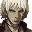

# The King Of Fighters 2001

## VMU Saves

| Icon | Filename | VMI | VMS | Description |
|------|----------|-----|-----|-------------|
|  | `KOF2001_0000` | [KOF_2001.VMI](KOF_2001.VMI) | [KOF_2001.VMS](KOF_2001.VMS) | Puzzle Mode & All Gallery Unlocked |
|  | `KOF2001_0000` | [v37891.vmi](v37891.vmi) | [v37891.VMS](v37891.VMS) | modo puzzle habilitadothe king of fighters 2001  |
|  | `KOF2001_0000` | [v91551.vmi](v91551.vmi) | [v91551.VMS](v91551.VMS) | KOF2001 mestres feitos.Perfectsalve.Aproveite.ass:GERECO.  |
