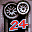

# Test Drive Le Mans

## VMU Saves

| Icon | Filename | VMI | VMS | Description |
|------|----------|-----|-----|-------------|
|  | `TDLEMANS.OPT` | [v74387.vmi](v74387.vmi) | [v74387.VMS](v74387.VMS) | todos modos abilitados todos carros todas fases  |
|  | `TDLEMANS.001` | [v21789.vmi](v21789.vmi) | [v21789.VMS](v21789.VMS) | All unlocked and 20 hours into a 24hour LeMans race  |
|  | `TDLEMANS.001` | [v49179.vmi](v49179.vmi) | [v49179.VMS](v49179.VMS) | Todas las pistas, todos los autos desbloqueados.Faltan 5 minutos para completar las 24hs de Le Mans.Trata de batir los tiempos.  |
|  | `TDLEMANS.001` | [v62691.vmi](v62691.vmi) | [v62691.VMS](v62691.VMS) | tudo de tudo completo. com 23 horasda corrida de 24 horas completo,e 11 voltas na frente do segundode valor a seu pais!!!  |
|  | `TDLEMANS.OPT` | [v6000.vmi](v6000.vmi) | [v6000.VMS](v6000.VMS) | All cars opened, all tracks opened. Everything complete!  |
|  | `TDLEMANS.001` | [v35838.vmi](v35838.vmi) | [v35838.VMS](v35838.VMS) | On the final lap of the 24hr Le Mans race using the Jaguar prototype. 3 laps ahead of the 2nd place car. Easy finish!  |
|  | `TDLEMANS.001` | [v16699.vmi](v16699.vmi) | [v16699.VMS](v16699.VMS) | All time trails, quickraces, and championships completed.  |
|  | `TDLEMANS.001` | [v42683.vmi](v42683.vmi) | [v42683.VMS](v42683.VMS) | 15 Hours into a 24hour race Expert mode. Everything unlocked.  |
|  | `TDLEMANS.OPT` | [v38692.vmi](v38692.vmi) | [v38692.VMS](v38692.VMS) | All quick races won, all but one championship race won.   |
|  | `TDLEMANS.OPT` | [v36820.vmi](v36820.vmi) | [v36820.VMS](v36820.VMS) | All tracks, all but two championshipscompleted, time trials almost complete.Many unlocked cars.  |
|  | `TDLEMANS.001` | [v40738.vmi](v40738.vmi) | [v40738.VMS](v40738.VMS) | 24 hours complete. All game modes complete, all cars.  |
|  | `TDLEMANS.001` | [v73041.vmi](v73041.vmi) | [v73041.VMS](v73041.VMS) | 41 carros disponiveis, todas as pistas e todos os modos completados modo 24,06,01 e 10 minutos completados, feitos pelo pH DO BRASIL>feitos pe.  |
|  | `TDLEMANS.OPT` | [v8626.vmi](v8626.vmi) | [v8626.VMS](v8626.VMS) | All races finished eccept the real 24hour Le mans race.   |
|  | `TDLEMANS.001` | [v70785.vmi](v70785.vmi) | [v70785.VMS](v70785.VMS) | Part 3 the last of the saved game files. This should be all you need to have all but 2 of the cars in the game.   |
|  | `TDLEMANS.001` | [v36893.vmi](v36893.vmi) | [v36893.VMS](v36893.VMS) | All track and cars unlocked even all the time trial race are beaten, The only cars that aren't gotten is the 24 hour race cars.  enjoy!!  |
|  | `TDLEMANS.OPT` | [v13162.vmi](v13162.vmi) | [v13162.VMS](v13162.VMS) | All quick race and championships unlocked...3 of 10 time trials completed...10min and 1hr le man's completed...21 cars available, all tracks...  |
|  | `LEMANS24.OPT` | [v31243.vmi](v31243.vmi) | [v31243.VMS](v31243.VMS) | Loads of cars and tracks 4 hours into 24 hour race Please download both saves Part 1 of 2  |
|  | `LEMANS24.001` | [v82547.vmi](v82547.vmi) | [v82547.VMS](v82547.VMS) | Loads of cars and tracks. 4 hours into 24 hour race. Part 2 of 2  |
|  | `TDLEMANS.OPT` | [v72767.vmi](v72767.vmi) | [v72767.VMS](v72767.VMS) | Some tracks a few extra cars and Uncle Chuckie and Hensley modes.  |
|  | `TDLEMANS.OPT` | [v8375.vmi](v8375.vmi) | [v8375.VMS](v8375.VMS) | All races in quick race mode finished! Jaguar unlocked  |
|  | `TDLEMANS.OPT` | [v91547.vmi](v91547.vmi) | [v91547.VMS](v91547.VMS) | All the tracks plus several cars unlocked.  |
|  | `LEMANS24.OPT` | [LEMANS24.VMI](LEMANS24.VMI) | [LEMANS24.VMS](LEMANS24.VMS) | All unlocked. |
