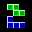

# VMU Mini Games

## VMU Saves

| Icon | Filename | VMI | VMS | Description |
|------|----------|-----|-----|-------------|
|  | `GAME_4WINS` | [4WINS.VMI](4WINS.VMI) | [4WINS.VMS](4WINS.VMS) | 4 Wins: You all know the principle of 4 wins: 2 players put chips into several columns. The chips fall down, the first player who got at least 4 of his chips in a row(diagonal, vertical or horizontal) wins. |
|  | `ALIENFIGHTER` | [ALNFIGHT.VMI](ALNFIGHT.VMI) | [ALNFIGHT.VMS](ALNFIGHT.VMS) | Alien Fighter: This game is a vertical scrolling shooter. You have to move your ship through tight passages, destroy cannons, ships and avoid bombs. Included are 4 levels of action. |
|  | `FATRAIN` | [FATRAIN.VMI](FATRAIN.VMI) | [FATRAIN.VMS](FATRAIN.VMS) | Fat Rain: Big Joce is sitting in the background and spits several sweets and bombs. You control a little man at the bottom and have to catch the sweets (not the bombs!) before they fell at the bottom. |
|  | `GLUCKYLABY` | [GLUCKY.VMI](GLUCKY.VMI) | [GLUCKY.VMS](GLUCKY.VMS) | Glucky Labyrinth: You are stuck in a building of several floors with each floor being a labyrinth of corridors. What you have to do is, find the exit of each labyrint to the next floor unti you reach the top. There are maps to find for each floor. |
|  | `IDO` | [IDOUDO.VMI](IDOUDO.VMI) | [IDOUDO.VMS](IDOUDO.VMS) | I do, U do: I simon says style game for the dreamcast VMU. |
|  | `SPACEINV` | [SI.VMI](SI.VMI) | [SI.VMS](SI.VMS) | Space Invaders: Aliens are invading our solar system and you are earth's only hope. |
|  | `LOGIC` | [LOGIC.VMI](LOGIC.VMI) | [LOGIC.VMS](LOGIC.VMS) | Logic: A very short game. No sound or savegame support. No menu and playing instructions. |
|  | `MINESWEEPER` | [MINE.VMI](MINE.VMI) | [MINE.VMS](MINE.VMS) | Minesweeper: An adaption of the classic minesweeper game for the VM. You got a board with 5x6 hidden fields. At the beginning, you can choose how many bombs(2-9) are hidden in the board. You have to open all fields, except the ones holding bombs. |
|  | `PACMAN` | [PACMAN.VMI](PACMAN.VMI) | [PACMAN.VMS](PACMAN.VMS) | VMU Mini Pacman: The classic PACMAN. You, beeing a hungry spot, have to eat through 2D labyrints and avoid ghosts. Hidden passages, special items make it very exciting. |
|  | `PAPER` | [PAPER.VMI](PAPER.VMI) | [PAPER.VMS](PAPER.VMS) | Paper Attack: A horizontal scrolling shooter. You can move your ship up and down and fire at flying rocks or bomb all out of the screen(limited amount). |
|  | `POWERSTONE` | [POWERSTN.VMI](POWERSTN.VMI) | [POWERSTN.VMS](POWERSTN.VMS) | Powerstone mini, by Capcom. |
|  | `SOULCALIBUR` | [SCALIBU.VMI](SCALIBU.VMI) | [SCALIBU.VMS](SCALIBU.VMS) | SoulCalibur, by Namco. A collection of 3 nice minigames. |
|  | `SKETCH` | [SKETCH.VMI](SKETCH.VMI) | [SKETCH.VMS](SKETCH.VMS) | VM-a-Sketch: Sorry, but I don't know what this game is about. Those who know Etch-a-Sketch or what will be able to use it. Seems somewhat similar to snake. |
|  | `SLIDEPUZZLE` | [SLIDEPUZ.VMI](SLIDEPUZ.VMI) | [SLIDEPUZ.VMS](SLIDEPUZ.VMS) | Slidepuzzle: The classic slide puzzle game you all might know. A board with 4x6 fields with numbers of the wrong number need to be slided in the right order. One field is empty, to allow sliding. |
|  | `SNAKY` | [SNAKY.VMI](SNAKY.VMI) | [SNAKY.VMS](SNAKY.VMS) | Snaky: An adaption of the classic game snake. You have to move the snake to not let it touch a wall or itself. The snake gets longer and longer. Several levels with increasing difficulty. |
|  | `SOUND_DEMO_1` | [SOUND.VMI](SOUND.VMI) | [SOUND.VMS](SOUND.VMS) | Sound Demo v1.0: Let's you generate all tones that the VMS can do. Explains the sound generation possibilities. |
|  | `SWAMPY` | [SWAMPY.VMI](SWAMPY.VMI) | [SWAMPY.VMS](SWAMPY.VMS) | Swampy: This is a tricky game. Imagine having a set of stones laying on the ground. Starting on one stone you have to jump on every other stone exact one time. You can only jump to neighbor stones. Lots of levels are included. |
|  | `TETRIS` | [TETRIS.VMI](TETRIS.VMI) | [TETRIS.VMS](TETRIS.VMS) | Tiny Tetris: The classic game tetris! Several types of block are falling from the top. You can turn them and move them to the left or right. The goal is to not let the screen fill up with block. One line disappears, when it's totally black. |
|  | `DEMOMOVIE` | [DANGELO.VMI](DANGELO.VMI) | [DANGELO.VMS](DANGELO.VMS) | D'Angelo music video. really an amazing video, captured from the music video "Untitled" by D'Angelo. |
|  | `DEMOMOVIE` | [E0.VMI](E0.VMI) | [E0.VMS](E0.VMS) | Enemy Zero training video. Yes, see me killing the first alien of E0's training! Not suited for VM that much like the videos above.  |
|  | `GREYSCALE` | [GREY.VMI](GREY.VMI) | [GREY.VMS](GREY.VMS) | fotoshow. A demo showing the power of the greyscale extension for B-movie;)v1.x. You won't believe to see this on VM! Images are not displayed just black and white, it's an attempt to make images more foto-realistic. |
|  | `DEMOMOVIE` | [MICHAEL.VMI](MICHAEL.VMI) | [MICHAEL.VMS](MICHAEL.VMS) | Michael Jackson music video. also very cool, captured from the music video "You rock my world" by Michael Jackson. |
|  | `DEMOMOVIE` | [PROMO.VMI](PROMO.VMI) | [PROMO.VMS](PROMO.VMS) | promotion video. introduces some features of B-movie;) compression. |
|  | `DEMOMOVIE` | [RISE.VMI](RISE.VMI) | [RISE.VMS](RISE.VMS) | sun & moon rise. Nothing to add to the title. Also made with Flash. B-movie;)v1.2 |
|  | `DEMOMOVIE` | [CIRCLES.VMI](CIRCLES.VMI) | [CIRCLES.VMS](CIRCLES.VMS) | circles. Nothing special, just used Flash to make this movie. B-movie;)v1.2 |
|  | `DC_ANIM.EXE` | [00003831.VMI](00003831.VMI) | [00003831.VMS](00003831.VMS) | Alien Shooter. Author: Loren Peace |
|  | `DC_ANIM.EXE` | [00006003.VMI](00006003.VMI) | [00006003.VMS](00006003.VMS) | Dragon Ball Z. Author: Brian Siklinski |
|  | `DC_ANIM.EXE` | [00003096.VMI](00003096.VMI) | [00003096.VMS](00003096.VMS) | Kill Hyman. Author: Loren Peace |
|  | `DC_ANIM.EXE` | [00003910.VMI](00003910.VMI) | [00003910.VMS](00003910.VMS) | Lightsabre Battle. Author: Ryan J |
|  | `DC_ANIM.EXE` | [00004662.VMI](00004662.VMI) | [00004662.VMS](00004662.VMS) | Neko 2.2. Author: Unknown  |
|  | `DC_ANIM.EXE` | [00004276.VMI](00004276.VMI) | [00004276.VMS](00004276.VMS) | Simon/Bryan. Author: Bryan Crow |
|  | `DC_ANIM.EXE` | [00003291.VMI](00003291.VMI) | [00003291.VMS](00003291.VMS) | Star Wars. Author: Ryan Jordan |
|  | `DC_ANIM.EXE` | [00001870.VMI](00001870.VMI) | [00001870.VMS](00001870.VMS) | Supercross VMU. Author: Unknown |
|  | `DC_ANIM.EXE` | [00004271.VMI](00004271.VMI) | [00004271.VMS](00004271.VMS) | VMU Fighter. Author: Unknown |
|  | `SHENMUE` | [4001.VMI](4001.VMI) | [4001.VMS](4001.VMS) | Shenmue mini game. |
|  | `SEGA_GT` | [4004.VMI](4004.VMI) | [4004.VMS](4004.VMS) | SEGA GT mini game. |
|  | `M_VS_C2` | [4007.VMI](4007.VMI) | [4007.VMS](4007.VMS) | Marvel vs. Capcom 2 mini game. |
|  | `POWSTONE2JP` | [4008.VMI](4008.VMI) | [4008.VMS](4008.VMS) | Power Stone 2 mini game, japanese version. |
|  | `BREAKOUT` | [BREAKOUT.VMI](BREAKOUT.VMI) | [BREAKOUT.VMS](BREAKOUT.VMS) | VMU Breakout by MJ |
|  | `GODZILLA` | [GODZILLA.VMI](GODZILLA.VMI) | [GODZILLA.VMS](GODZILLA.VMS) | Godzilla mini game by SEGA. |
|  | `CHAOEDIT2` | [CHAO2.VMI](CHAO2.VMI) | [CHAO2.VMS](CHAO2.VMS) | Chao Editor 2 by Tyro. |
|  | `CHAOEDIT` | [CHAOEDIT.VMI](CHAOEDIT.VMI) | [CHAOEDIT.VMS](CHAOEDIT.VMS) | Chao Editor by Tyro. |
|  | `D_RACER` | [DRACER.VMI](DRACER.VMI) | [DRACER.VMS](DRACER.VMS) | Dream Racer. |
|  | `FROG` | [FROG.VMI](FROG.VMI) | [FROG.VMS](FROG.VMS) | Frog in a blender. |
|  | `FREAKSKATE` | [FSKATER.VMI](FSKATER.VMI) | [FSKATER.VMS](FSKATER.VMS) | Freak Skater |
|  | `JOJOPROB` | [JOJO.VMI](JOJO.VMI) | [JOJO.VMS](JOJO.VMS) | Jojo's Problem |
|  | `HELLO_KITTY` | [KITTYCAT.VMI](KITTYCAT.VMI) | [KITTYCAT.VMS](KITTYCAT.VMS) | Hello Kitty mini game. |
|  | `LIN_WATCH` | [MINICLOC.VMI](MINICLOC.VMI) | [MINICLOC.VMS](MINICLOC.VMS) | Linear's Watch. |
|  | `POPMUSIC1` | [POPMUSI1.VMI](POPMUSI1.VMI) | [POPMUSI1.VMS](POPMUSI1.VMS) | Pop n Music Vol 1 mini game. |
|  | `POPMUSIC2` | [POPMUSI2.VMI](POPMUSI2.VMI) | [POPMUSI2.VMS](POPMUSI2.VMS) | Pop n Music Vol 2 mini game. |
|  | `POPMUSIC3` | [POPMUSI3.VMI](POPMUSI3.VMI) | [POPMUSI3.VMS](POPMUSI3.VMS) | Pop n Music Vol 3 mini game. |
|  | `PSOIDCALC` | [PSOID.VMI](PSOID.VMI) | [PSOID.VMS](PSOID.VMS) | PSO ID Calculator |
|  | `SPUZZLE` | [PSOPUZZL.VMI](PSOPUZZL.VMI) | [PSOPUZZL.VMS](PSOPUZZL.VMS) | PSO Slide Puzzle. |
|  | `SOULC2ADV` | [SOUL2ADV.VMI](SOUL2ADV.VMI) | [SOUL2ADV.VMS](SOUL2ADV.VMS) | Soul Calibur 2 Adventure mini game by Namco. |
|  | `TOKYOCAR` | [TOKYOCAR.VMI](TOKYOCAR.VMI) | [TOKYOCAR.VMS](TOKYOCAR.VMS) | Tokyo Car race. |
|  | `VMUVISION` | [VISION1.VMI](VISION1.VMI) | [VISION1.VMS](VISION1.VMS) | VMU Vision by Tyro. |
|  | `CHAO_ADV` | [VMFL_073.VMI](VMFL_073.VMI) | [VMFL_073.VMS](VMFL_073.VMS) | Chao Adventure by SEGA. |
|  | `TECHROMANCER` | [VMFL_081.VMI](VMFL_081.VMI) | [VMFL_081.VMS](VMFL_081.VMS) | Tech Romancer mini game. |
|  | `CLIMAX` | [VMFL_084.VMI](VMFL_084.VMI) | [VMFL_084.VMS](VMFL_084.VMS) | Climax Landers mini game. |
|  | `WHEREBRUCE` | [VMWBP.VMI](VMWBP.VMI) | [VMWBP.VMS](VMWBP.VMS) | Where's Bruce? |
|  | `FOOTBALL` | [ZUQIU.VMI](ZUQIU.VMI) | [ZUQIU.VMS](ZUQIU.VMS) | VMU Football mini game. |
|  | `CARDCAPTOR` | [SCCBRK.VMI](SCCBRK.VMI) | [SCCBRK.VMS](SCCBRK.VMS) | Sakura Card Captors Breakout mini game. |
|  | `FASTNFURIOUS` | [FASTFURI.VMI](FASTFURI.VMI) | [FASTFURI.VMS](FASTFURI.VMS) | The Fast and the Furious vmu animation by Kalin Krastev |
|  | `MATRIXRELOAD` | [MATRXRLD.VMI](MATRXRLD.VMI) | [MATRXRLD.VMS](MATRXRLD.VMS) | Matrix Reloaded vmu animation by Kalin Krastev |
|  | `S.ARCADIA_VM` | [PQ_NTSC.VMI](PQ_NTSC.VMI) | [PQ_NTSC.VMS](PQ_NTSC.VMS) | Skies of Arcadia Pinta's Quest (NTSC). Map 100% open, level 1. |
|  | `S.ARCADIA_VM` | [PQ_PAL.VMI](PQ_PAL.VMI) | [PQ_PAL.VMS](PQ_PAL.VMS) | Skies of Arcadia Pinta's Quest (PAL). Map 20% open, level 1. |
|  | `S.ARCADIA_VM` | [SOAMINI.VMI](SOAMINI.VMI) | [SOAMINI.VMS](SOAMINI.VMS) | Skies of Arcadia mini game Pinta's Quest by SEGA |
