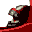

# Monaco Grand Prix

## VMU Saves

| Icon | Filename | VMI | VMS | Description |
|------|----------|-----|-----|-------------|
|  | `MONACOGP.PIL` | [v42190.vmi](v42190.vmi) | [v42190.VMS](v42190.VMS) | Season 2002 cars and drivers.Saison 2002 pilotes et voituresToyota a pris la place de minardi(faute de place)  |
|  | `MONACOGP.PIL` | [v88272.vmi](v88272.vmi) | [v88272.VMS](v88272.VMS) | 2002 season cars and drivers!  |
|  | `MONACOGP.PIL` | [v73003.vmi](v73003.vmi) | [v73003.VMS](v73003.VMS) | 2001 season cars and drivers!  |
|  | `MONACOGP.PIL` | [v15989.vmi](v15989.vmi) | [v15989.VMS](v15989.VMS) | 2000 season cars and drivers!  |
