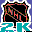
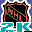

# Sega Sports NHL 2K

## VMU Saves

| Icon | Filename | VMI | VMS | Description |
|------|----------|-----|-----|-------------|
|  | `SEGANHL2KP00` | [v67813.vmi](v67813.vmi) | [v67813.VMS](v67813.VMS) | new flyers...dopita..fedetenko..and the like (fedoruk)  |
|  | `SEGANHL2KR00` | [v41034.vmi](v41034.vmi) | [v41034.VMS](v41034.VMS) | new rosters and some dynamic creadted players  |
|  | `SEGANHL2KR00` | [v62214.vmi](v62214.vmi) | [v62214.VMS](v62214.VMS) | complete flyers team as of 01-01-02  |
|  | `SEGANHL2KR00` | [v70236.vmi](v70236.vmi) | [v70236.VMS](v70236.VMS) | Rosters as of 01-26-01.  |
|  | `SEGANHL2KR00` | [v90806.vmi](v90806.vmi) | [v90806.VMS](v90806.VMS) | Updated rosters as of 11/2.  This file is more up to date than my last one.  |
|  | `SEGANHL2KR00` | [v9750.vmi](v9750.vmi) | [v9750.VMS](v9750.VMS) | Updated rosters as of 10/10.  I have tried to update the rosters as best as I can, but I may have missed some of the trades and free agent signings.  Keep in mind that it is impossible to have completely updated rosters because the Minnesota Wil |
|  | `SEGANHL2KR00` | [v39355.vmi](v39355.vmi) | [v39355.VMS](v39355.VMS) | NHL 2k rosters 7/25/00  |
|  | `SEGANHL2KR00` | [00000503.vmi](00000503.vmi) | [00000503.VMS](00000503.VMS) | NHL 2K Rosters as of 2/15/2000.  |
