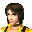

# Outtrigger

## VMU Saves

| Icon | Filename | VMI | VMS | Description |
|------|----------|-----|-----|-------------|
|  | `OUTTRIGR.SYS` | [v89056.vmi](v89056.vmi) | [v89056.VMS](v89056.VMS) | All weapons and charactersunlocked !!  |
|  | `OUTTRIGR.SYS` | [v95711.vmi](v95711.vmi) | [v95711.VMS](v95711.VMS) | Tudo completo, so falta jogar!  |
|  | `OUTTRIGR.SYS` | [v7936.vmi](v7936.vmi) | [v7936.VMS](v7936.VMS) | im piccolo_09 the online gamer fromdaytona,outtrigger,speed devils,and alien front onlinewanna challenge email mesave file has everything unlocked  |
|  | `OUTTRIGR.SYS` | [v47583.vmi](v47583.vmi) | [v47583.VMS](v47583.VMS) | This Save File Has One SecertCharacter Open.Novice Mission ModeIs Complete  |
|  | `OUTTRIGR.SYS` | [v56049.vmi](v56049.vmi) | [v56049.VMS](v56049.VMS) | este es el qrchivo de lee soloque superado en algunas cosas  |
|  | `OUTTRIGR.SYS` | [v56939.vmi](v56939.vmi) | [v56939.VMS](v56939.VMS) | Secret characters, weapons, and levels unlocked.   |
|  | `OUTTRIGR.SYS` | [v73218.vmi](v73218.vmi) | [v73218.VMS](v73218.VMS) | All weapons, characters unlocked.  |
|  | `OUTTRIGR.SYS` | [v32544.vmi](v32544.vmi) | [v32544.VMS](v32544.VMS) | I guess that its a good save. Its a start on the gamewith the novice missions complete, I also have 2 secretcharacters, one or two extra stages. And some damn goodhigh scores.   |
|  | `OUTTRIGR.SYS` | [v4846.vmi](v4846.vmi) | [v4846.VMS](v4846.VMS) | All missions complete, all characters unlocked, and all weapons available.  |
|  | `OUTTRIGR.SYS` | [OUT_EURO.VMI](OUT_EURO.VMI) | [OUT_EURO.VMS](OUT_EURO.VMS) | Cool save for Outtrigger! |
|  | `OUTTRIGR.SYS` | [OUTTRIGR.VMI](OUTTRIGR.VMI) | [OUTTRIGR.VMS](OUTTRIGR.VMS) | All unlocked. |
