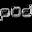

# POD: Speedzone

## VMU Saves

| Icon | Filename | VMI | VMS | Description |
|------|----------|-----|-----|-------------|
|  | `POD_MLTP.SYS` | [v52396.vmi](v52396.vmi) | [v52396.VMS](v52396.VMS) | some levels beat and some other stuff  |
|  | `POD_MLTP.SYS` | [podsave.VMI](podsave.VMI) | [podsave.VMS](podsave.VMS) | This save file has extra cars and a track unlocked that were only accessable if an online account was created. The save has cars 'Crab' and 'Bulldog', as well as the track 'Oddrock' unlocked. |
