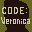
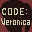

# Resident Evil: Code Veronica

## VMU Saves

| Icon | Filename | VMI | VMS | Description |
|------|----------|-----|-----|-------------|
|  | `RE_CV000.001` | [v49956.vmi](v49956.vmi) | [v49956.VMS](v49956.VMS) | On disk 2 with inf. herbs and magnum. Also all weapoms with 999 ammo.  |
|  | `RE_CV000.SYS` | [v33626.vmi](v33626.vmi) | [v33626.VMS](v33626.VMS) | All game modes avaliable, linear and rocket weapons avaliable and all characters.  |
|  | `RE_CV000.005` | [v43934.vmi](v43934.vmi) | [v43934.VMS](v43934.VMS) | Infinate rocket launcher, plenty of herbs and f-aid sprays. About 70% through the first disk. I hope u enjoy it.  |
|  | `RE_CV000.005` | [v89183.vmi](v89183.vmi) | [v89183.VMS](v89183.VMS) | ALL MODES,BATTLE MODE WESKER PLAYABLE END OF GAME AT WHERE FIRST RE TOOK PLACE  TELL ME WHAT YOU THINK OF IT  |
|  | `RE_CV000.015` | [v58348.vmi](v58348.vmi) | [v58348.VMS](v58348.VMS) | The best save take this and you will be satisfied towards the beginning with Claire look inside the chest it has EVERYTHING!  |
|  | `RE_CV000.001` | [v39417.vmi](v39417.vmi) | [v39417.VMS](v39417.VMS) | Just before the fight in the plane. You got 999 ammo for the pistol, 14 sprays, 17 mixed herbs, infinite linear launcher, infinite magnum, infinite ink ribbon and mp-100 fully loaded. This save is not hacked, I play and catch a lot of things, d |
|  | `RE_CV000.001` | [v65733.vmi](v65733.vmi) | [v65733.VMS](v65733.VMS) | Everything unlocked! All weapons and infinite ammo!  |
|  | `RE_CV000.004` | [v70045.vmi](v70045.vmi) | [v70045.VMS](v70045.VMS) | Unlimited rocket launcher (not linear launcher) unlocked for main game.  |
|  | `RE_CV000.002` | [v84106.vmi](v84106.vmi) | [v84106.VMS](v84106.VMS) | the tyrant battle on the plane  |
|  | `RE_CV000.001` | [v20350.vmi](v20350.vmi) | [v20350.VMS](v20350.VMS) | EVERYTHING UNLOCKED BATTLE GAME IS ALL DONE GOT SERECT CHARACTERS TOO!  |
|  | `RE_CV000.003` | [v33557.vmi](v33557.vmi) | [v33557.VMS](v33557.VMS) | PLAY AS WESKER!!!! Open up the storage box. Oh yeah don't get hit by bats!  |
|  | `RE_CV000.001` | [v60781.vmi](v60781.vmi) | [v60781.VMS](v60781.VMS) | Start with Claire with infinite magnun, linear launcher & ink ribbon.  |
|  | `RE_CV000.001` | [v63276.vmi](v63276.vmi) | [v63276.VMS](v63276.VMS) | Start on first disk and play as tyrant.This will only work if you have a gamesharkin and then start game without codes.  |
|  | `RE_CV000.002` | [v42832.vmi](v42832.vmi) | [v42832.VMS](v42832.VMS) | Start of Disc 2. Enjoy.  |
|  | `RE_CV000.012` | [v12495.vmi](v12495.vmi) | [v12495.VMS](v12495.VMS) | Be a special person starting from the first disk! AHAHAHAHAH Its really cool! e-mail me if you want more to play as others!<a href="mailto:widkidzzz@yahoo.com">widkidzzz@yahoo.com!</a> we will trade vmu files!  |
|  | `RE_CV000.001` | [v64920.vmi](v64920.vmi) | [v64920.VMS](v64920.VMS) | Ultimate, gameshark enhanced save!All weapons fully loaded (most w/999 bullets) and mad mixed herbs.You even get to play with the sniperrifle & linear launcher!Saved right before the final battle!Enjoy!!!!   |
|  | `CDX_SETTINGS` | [v69325.vmi](v69325.vmi) | [v69325.VMS](v69325.VMS) | Download this for infinity everything!!!  |
|  | `RE_CV000.002` | [v77209.vmi](v77209.vmi) | [v77209.VMS](v77209.VMS) | on disk 2 with cris redfield check your item box!  |
|  | `RE_CV000.003` | [v12018.vmi](v12018.vmi) | [v12018.VMS](v12018.VMS) | Check this huge box full of weapons and infinite herbs!!!  |
|  | `RE_CV000.003` | [v43618.vmi](v43618.vmi) | [v43618.VMS](v43618.VMS) | Right before final boss with HEAVY firepower. Magnum(18), Assault Rifle(70%), 100% Submachine Guns, 10 explosive arrows, Grenade launcher(lots of grenades).  |
|  | `RE_CV000.002` | [v81216.vmi](v81216.vmi) | [v81216.VMS](v81216.VMS) | when you get to the first save point you have a bazzoka with inf ammo  |
|  | `RE_CV000.SYS` | [v61271.vmi](v61271.vmi) | [v61271.VMS](v61271.VMS) | Question what does all A's in battle gameequal linear launcher!!!!!!!  |
|  | `RE_CV000.SYS` | [v62187.vmi](v62187.vmi) | [v62187.VMS](v62187.VMS) | battle mode unlocked  |
|  | `RE_CV000.015` | [v41499.vmi](v41499.vmi) | [v41499.VMS](v41499.VMS) | here it is retep, hope it helpd ya  |
|  | `RE_CV000.SYS` | [v22475.vmi](v22475.vmi) | [v22475.VMS](v22475.VMS) | Battle game with linear luancher  |
|  | `RE_CV000.013` | [v46677.vmi](v46677.vmi) | [v46677.VMS](v46677.VMS) | start game with wesker RE1!  |
|  | `RE_CV000.SYS` | [v52935.vmi](v52935.vmi) | [v52935.VMS](v52935.VMS) | All characters and weapons includingthe Linear Launcher unlocked.  |
|  | `RE_CV000.001` | [v52407.vmi](v52407.vmi) | [v52407.VMS](v52407.VMS) | Start of the game with a Magnum withinfinite ammo and an infinite mixedherb. All the weapons with infiniteammo in the first item box.  |
|  | `RE_CV000.002` | [v84865.vmi](v84865.vmi) | [v84865.VMS](v84865.VMS) | End of the game with all the weapons and items in the items box.  |
|  | `RE_CV000.SYS` | [v81176.vmi](v81176.vmi) | [v81176.VMS](v81176.VMS) | PERFECT BATTLE MODE  |
|  | `RE_CV000.001` | [00000886.vmi](00000886.vmi) | [00000886.VMS](00000886.VMS) | End of the game. When you get to Alexia, hold UP when close to her and hit her SIX times with the G.Launcher, she'll die, I guarentee!  |
|  | `VERONICA.SYS` | [biocsys1.VMI](biocsys1.VMI) | [biocsys1.VMS](biocsys1.VMS) | System Save! All secrets open! |
|  | `VERONICA.004` | [bioc001.VMI](bioc001.VMI) | [bioc001.VMS](bioc001.VMS) | Last Save! |
|  | `RE_CV000.SYS` | [v12022.vmi](v12022.vmi) | [v12022.VMS](v12022.VMS) | Save for start of game. You have special gun and infinite ammo.  |
