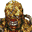

# Resident Evil 3: Nemesis

## VMU Saves

| Icon | Filename | VMI | VMS | Description |
|------|----------|-----|-----|-------------|
|  | `RESEVIL3.SYS` | [v27920.vmi](v27920.vmi) | [v27920.VMS](v27920.VMS) | Voce que e kabaso esse filenao tem mais de 3 telas completase que SE-FORDASE VOCE!!!!!!!!!   |
|  | `RESEVIL3.002` | [v72986.vmi](v72986.vmi) | [v72986.VMS](v72986.VMS) | 60% of the game completed |
|  | `RESEVIL3.004` | [v91831.vmi](v91831.vmi) | [v91831.VMS](v91831.VMS) | Jill's Diary save. Final save before the end of the game. All you need to do is get the"Incinerator Manual" (beside the ladder when you escape) and the "Classified Photo File" (outsideon the ground right after theshockwave). After you've gotten |
|  | `RESEVIL3.SYS` | [v33463.vmi](v33463.vmi) | [v33463.VMS](v33463.VMS) | Have all of the epligoues, all of the items bought. Great for beginners who wanna take the easy way outand win.  |
|  | `RESEVIL3.SYS` | [v1995.vmi](v1995.vmi) | [v1995.VMS](v1995.VMS) | This is a code for somebody who who don"t want every secert solve.Epilogue,unlimited ammo on therocket launcher,gatlin gun, and M16 rifle.Have Fun!  |
|  | `RESEVIL3.SYS` | [v63312.vmi](v63312.vmi) | [v63312.VMS](v63312.VMS) | This will help people who want to beat the game,but don"t want somebody to get all sercets just what you need to win. 3 epilogue,$2,567 dollars and unlimited ammo for the rocket launcher,gatlin gun,and M16 rifle.Have fun.   |
|  | `RESEVIL3.001` | [v22935.vmi](v22935.vmi) | [v22935.VMS](v22935.VMS) | Half way done, every weapon, alot of money. Saved with both endings.  |
|  | `RESEVIL3.SYS` | [v61857.vmi](v61857.vmi) | [v61857.VMS](v61857.VMS) | Saved with both endings. Infinite everything. 95% done with files beatin 12 times in a week.  |
|  | `RESEVIL3.SYS` | [v61221.vmi](v61221.vmi) | [v61221.VMS](v61221.VMS) | This should be a save right before the final bought with the Tyrant. 2 rocket launchers, with infinite ammo, gattling gun, assault rifle, magnum, all infinite ammo. Plenty of herbs, and aid sprays, All epilouges, try to complete the game two ti |
|  | `RESEVIL3.SYS` | [v98299.vmi](v98299.vmi) | [v98299.VMS](v98299.VMS) | System save for start of a new game with all weapons, inf. ammo, and all 8 epilogues viewable. Enjoy!!!  |
|  | `RESEVIL3.003` | [v96903.vmi](v96903.vmi) | [v96903.VMS](v96903.VMS) | Perfect save for novice players, already with all special weapons from the Mercenaries Mode (Assault Rifle, Gattling Gun and Rocket Luncher), just take the rocket and say to Nemesis "GOOD BYE", unlimited ammo to all weapon of the game, choose y |
|  | `RESEVIL3.SYS` | [v64093.vmi](v64093.vmi) | [v64093.VMS](v64093.VMS) | When you start game, you have M4A1, GATLING GUNand M66 in box and infinite ammo.  |
|  | `RESEVIL3.SYS` | [v65367.vmi](v65367.vmi) | [v65367.VMS](v65367.VMS) | Rocket launcher and assault riflefor hard mode!!!  |
|  | `RESEVIL3.SYS` | [v88744.vmi](v88744.vmi) | [v88744.VMS](v88744.VMS) | Save to new game with all mercenaries’ items and 4 epilogues.  |
|  | `RESEVIL3.SYS` | [v87889.vmi](v87889.vmi) | [v87889.VMS](v87889.VMS) | About $4500 in mercinary mode.  |
|  | `RESEVIL3.SYS` | [v2671.vmi](v2671.vmi) | [v2671.VMS](v2671.VMS) | Gattling gun in chest for hardmode.  |
|  | `RESEVIL3.001` | [v71483.vmi](v71483.vmi) | [v71483.VMS](v71483.VMS) | This game is saved at the half way point of the game at the church right after you lost contact with Carlos lots weapons in the box in the save room.  |
|  | `RESEVIL3.001` | [v86309.vmi](v86309.vmi) | [v86309.VMS](v86309.VMS) | Right before the last nemises  |
|  | `RESEVIL3.001` | [v53088.vmi](v53088.vmi) | [v53088.VMS](v53088.VMS) | Great save all guns and inf. health  |
|  | `RESEVIL3.001` | [v67159.vmi](v67159.vmi) | [v67159.VMS](v67159.VMS) | Saved right before you get to the gate of the park with one gem already in the clock and one on you.  |
|  | `BIOHAZRD3SYS` | [bio3jpsy.VMI](bio3jpsy.VMI) | [bio3jpsy.VMS](bio3jpsy.VMS) | SYSTEM date! All secret unlocked!(JP) |
|  | `BIOHAZRD3A05` | [bio3a05.VMI](bio3a05.VMI) | [bio3a05.VMS](bio3a05.VMS) | Super Save! All weapons!(JP) |
|  | `RESEVIL3.001` | [v67409.vmi](v67409.vmi) | [v67409.VMS](v67409.VMS) | 100% completo  |
|  | `RESEVIL3.SYS` | [v93576.vmi](v93576.vmi) | [v93576.VMS](v93576.VMS) | Todas as armas infinitas quando pegadas. E com algumas armas ja infinitas no comeco. COOOOLLLLLLLL  |
|  | `RESEVIL3.002` | [v18254.vmi](v18254.vmi) | [v18254.VMS](v18254.VMS) | All weapons with infinite ammo. Try to beat this save twice to see both endings.  |
|  | `RESEVIL3.SYS` | [v27144.vmi](v27144.vmi) | [v27144.VMS](v27144.VMS) | This save has all the file for you to view. All weapons at max all weapons are in the box and you can view both endings of the game.  |
