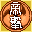
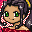

# Sakura Wars 4

## VMU Saves

| Icon | Filename | VMI | VMS | Description |
|------|----------|-----|-----|-------------|
|  | `SAKURA_4.SYS` | [00000023.vmi](00000023.vmi) | [00000023.VMS](00000023.VMS) | Perfect Save! Everything Unlocked! |
|  | `SAKURA_4.001` | [sw4_001.VMI](sw4_001.VMI) | [sw4_001.VMS](sw4_001.VMS) | Game file! Sakura's Ending! |
|  | `SAKURA_4.002` | [sw4_002.VMI](sw4_002.VMI) | [sw4_002.VMS](sw4_002.VMS) | Game file! Erika's Ending! |
|  | `SAKURA_4.002` | [sw4_003.VMI](sw4_003.VMI) | [sw4_003.VMS](sw4_003.VMS) | Game file! Roberia's Ending! |
|  | `SAKURA_4.005` | [sw4_004.VMI](sw4_004.VMI) | [sw4_004.VMS](sw4_004.VMS) | Game file! Orihime's Ending! |
|  | `SAKURA_4.004` | [sw4_005.VMI](sw4_005.VMI) | [sw4_005.VMS](sw4_005.VMS) | Game file! Sumire's Ending! |
|  | `SAKURA_4.003` | [sw4_006.VMI](sw4_006.VMI) | [sw4_006.VMS](sw4_006.VMS) | Game file! Gorisei's Ending! |
