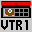

# Sakura Card Captor: Tomoyo Video

## VMU Saves

| Icon | Filename | VMI | VMS | Description |
|------|----------|-----|-----|-------------|
|  | `CCS_TOMO.001` | [v14383.vmi](v14383.vmi) | [v14383.VMS](v14383.VMS) | VMU SAVE for SAKURA CARD captor (dreamcast game) in second stage |
