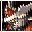

# Seirei Hata Ray Blade

## VMU Saves

| Icon | Filename | VMI | VMS | Description |
|------|----------|-----|-----|-------------|
|  | `RAYBLADE_001` | [SHENGLJ1.VMI](SHENGLJ1.VMI) | [SHENGLJ1.VMS](SHENGLJ1.VMS) | Money Max at Stage 1! |
|  | `RAYBLADE_001` | [SHENGLJ2.VMI](SHENGLJ2.VMI) | [SHENGLJ2.VMS](SHENGLJ2.VMS) | High Level at Stage 1! |
