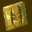

# Shadow Man

## VMU Saves

| Icon | Filename | VMI | VMS | Description |
|------|----------|-----|-----|-------------|
|  | `SHADOMAN.000` | [v1056.vmi](v1056.vmi) | [v1056.VMS](v1056.VMS) | 120 dark souls,todos cadeaux todos segredos.tudo aberto ate o book of shadows todas as armas. .   |
|  | `SHADOMAN.000` | [v67545.vmi](v67545.vmi) | [v67545.VMS](v67545.VMS) | this is good save for person that start this game.man ta nimehai in bazi pish raftam vali badbakhtane rahi peida nakardam.  |
|  | `SHADOMAN.000` | [v92438.vmi](v92438.vmi) | [v92438.VMS](v92438.VMS) | The actual game file save. Everything beaten. Need to DL this one and the other one to get all levels, cheats & movies.  |
|  | `SHADOMAN.SYS` | [v49533.vmi](v49533.vmi) | [v49533.VMS](v49533.VMS) | game beaten with everything unlocked  |
|  | `SHADOMAN.SYS` | [v7967.vmi](v7967.vmi) | [v7967.VMS](v7967.VMS) | algunos cheats de este gran juego  |
|  | `SHADOMAN.000` | [v98125.vmi](v98125.vmi) | [v98125.VMS](v98125.VMS) | All 120 dark souls, 98 cardeux (only2 remaining), most cheats, most cutscenes, plus Book of Shadows. Enjoy!  |
|  | `SHADOMAN.002` | [v78723.vmi](v78723.vmi) | [v78723.VMS](v78723.VMS) | 120 dark souls and secret Book of Shadows.  Most cheats unlocked.  |
|  | `SHADOMAN.000` | [v6915.vmi](v6915.vmi) | [v6915.VMS](v6915.VMS) | FINAL BATTLE & SUPER FORCE  |
|  | `SHADOMAN.000` | [v94384.vmi](v94384.vmi) | [v94384.VMS](v94384.VMS) | Everything beat  |
|  | `SHADOMAN.000` | [v75146.vmi](v75146.vmi) | [v75146.VMS](v75146.VMS) | This is saved right before the final battle with Legion. All abilities gained, as well as all cardeux & dark souls. Not every secret, tho', some bug ate some of them. Enjoy the ones that are there!  |
|  | `ICONDATA_VMS` | [v8737.vmi](v8737.vmi) | [v8737.VMS](v8737.VMS) | Shadowman Voodo Teddy bear VMU icon. |
