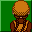

# Shenmue II

## VMU Saves

| Icon | Filename | VMI | VMS | Description |
|------|----------|-----|-----|-------------|
|  | `SHENMUE2_001` | [v44127.vmi](v44127.vmi) | [v44127.VMS](v44127.VMS) | finished file almost all battles ,2gambling games&outrun afterburner2 ,watchable video of saturn shenmue!  |
|  | `SHENMUE2_002` | [v63309.vmi](v63309.vmi) | [v63309.VMS](v63309.VMS) | in end you only must put the fenix mirror in tower to see the endcoolno final voce so precisa colocar o espelhoe fenix na torrepra ver o finallegal  |
|  | `SHENMUE2_003` | [v27133.vmi](v27133.vmi) | [v27133.VMS](v27133.VMS) | disc1 almost finished  |
|  | `SHENMUE2_001` | [v71447.vmi](v71447.vmi) | [v71447.VMS](v71447.VMS) | Disc 2 Starting file (euro-version)  |
|  | `SHENMUE2_003` | [v90755.vmi](v90755.vmi) | [v90755.VMS](v90755.VMS) | Ryo in Guilin (DISC4) near the end of game   |
|  | `SHENMUE2_SYS` | [v55976.vmi](v55976.vmi) | [v55976.VMS](v55976.VMS) | primeiro disk completado com os mapas e dinheiro save enviado por dreammoz santo andre   |
|  | `SHENMUE2_003` | [v27090.vmi](v27090.vmi) | [v27090.VMS](v27090.VMS) | Disk 3 - Kowloon - plenty of money  |
|  | `SHENMUE2_002` | [v85405.vmi](v85405.vmi) | [v85405.VMS](v85405.VMS) | in dragon street with most of the new moves ready to go to yellow head building.This is the PAL english version from UK.  |
|  | `SHENMUE2_SYS` | [v56642.vmi](v56642.vmi) | [v56642.VMS](v56642.VMS) | jap version.4 days after arrival  |
|  | `SHENMUE2_SYS` | [v45532.vmi](v45532.vmi) | [v45532.VMS](v45532.VMS) | cd 3-Ryo ta num lugar la,ele ta procurando o lan di ainda.Eu soube q shenmue2 americano nao vai mais sai e to esperando o europeu a porra da sega americana eh uma merda fica com frescura agora shenmue2 americano so vai sai pa x-box...e nois pob |
|  | `SHENMUE2_001` | [v28239.vmi](v28239.vmi) | [v28239.VMS](v28239.VMS) | my update is here- This is disc 4 just follow shenhua in the path shegoes and you have to find other waysas will but this should only take an 1-2 hours maybe a little more  |
|  | `SHENMUE2_001` | [v10347.vmi](v10347.vmi) | [v10347.VMS](v10347.VMS) | the starting of the 2nd disc...enjoy!  |
|  | `SHENMUE2_002` | [v43574.vmi](v43574.vmi) | [v43574.VMS](v43574.VMS) | disc 2 completed   |
|  | `SHENMUE2_002` | [v24601.vmi](v24601.vmi) | [v24601.VMS](v24601.VMS) | START OF THE DISC 3 with 1900$  BY ALBERTO EL DIBAS PUERTO RICO THANKS PLANET WEB  |
|  | `SHENMUE2_003` | [v91835.vmi](v91835.vmi) | [v91835.VMS](v91835.VMS) | (Euro Version)A finished game file.This has all of the Arcade games and all but one fight available in the 4th disk mode. I collected many neat collectibles and the Saturn Version of Shenmue movie is available. This save is great if you want to |
|  | `SHENMUE2_002` | [v37819.vmi](v37819.vmi) | [v37819.VMS](v37819.VMS) | [euro ver.] 1/4 way of 3rd cd[still in kowloon] with quite an amount of cash.  |
|  | `SHENMUE2_001` | [v15126.vmi](v15126.vmi) | [v15126.VMS](v15126.VMS) | //start on disc2//  |
|  | `SHENMUE2_003` | [v56186.vmi](v56186.vmi) | [v56186.VMS](v56186.VMS) | in the middle of disc 2.anybody out there playing shenmue2?ITS A GREAT GAME!!! BUY&PLAY IT NOW!!for europe version only.  |
|  | `SHENMUE2_002` | [v76448.vmi](v76448.vmi) | [v76448.VMS](v76448.VMS) | the beginning of disc 3  |
|  | `SHENMUE2_SYS` | [v45346.vmi](v45346.vmi) | [v45346.VMS](v45346.VMS) | Todos os meios de se ir loge neste jogo ja descoberto nesta versao japonesa por um Brasileiro.  |
|  | `SHENMUE2_SYS` | [shen2sys.VMI](shen2sys.VMI) | [shen2sys.VMS](shen2sys.VMS) | system data! all collections! include Saturn Shenmue |
|  | `SHENMUE2_002` | [SM2JPMAX.VMI](SM2JPMAX.VMI) | [SM2JPMAX.VMS](SM2JPMAX.VMS) | 1st save from game start! money & skill max |
|  | `SHENMUE2_002` | [shen2las.VMI](shen2las.VMI) | [shen2las.VMS](shen2las.VMS) | Last save, you'll clear the game within 5 minutes |
|  | `SHENMUE2_003` | [shenbad.VMI](shenbad.VMI) | [shenbad.VMS](shenbad.VMS) | Shenmue2 Bad Ending |
|  | `SHENMUE2_SYS` | [00000036.vmi](00000036.vmi) | [00000036.VMS](00000036.VMS) | system data! Saturn Shenmue Unlocked |
|  | `SHENMUE2_001` | [00000037.vmi](00000037.vmi) | [00000037.VMS](00000037.VMS) | Disc 2 Start Save |
|  | `SHENMUE2_002` | [00000038.vmi](00000038.vmi) | [00000038.VMS](00000038.VMS) | Disc 3 Start Save |
|  | `SHENMUE2_003` | [00000039.vmi](00000039.vmi) | [00000039.VMS](00000039.VMS) | Disc 4 Start Save |
|  | `SHENMUE2_SYS` | [SHENM2S.VMI](SHENM2S.VMI) | [SHENM2S.VMS](SHENM2S.VMS) | Most collection unlocked. System save. |
|  | `SHENMUE2_003` | [SHENM2G.VMI](SHENM2G.VMI) | [SHENM2G.VMS](SHENM2G.VMS) | Most collection unlocked. Game save. |
|  | `SHENMUE2_001` | [v28795.vmi](v28795.vmi) | [v28795.VMS](v28795.VMS) | in this save Ryo mastered all moves and completed notes.and you can sparring with elieen and izumi at pine arcade game  |
|  | `SHENMUE2_003` | [SHEN2PAL.VMI](SHEN2PAL.VMI) | [SHEN2PAL.VMS](SHEN2PAL.VMS) | All collection data available (PAL save) |
