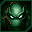

# Slave Zero

## VMU Saves

| Icon | Filename | VMI | VMS | Description |
|------|----------|-----|-----|-------------|
|  | `SLAVEZERO.04` | [v33117.vmi](v33117.vmi) | [v33117.VMS](v33117.VMS) | The ultimate save   |
|  | `SLAVEZERO.01` | [v88295.vmi](v88295.vmi) | [v88295.VMS](v88295.VMS) | level 12  |
|  | `SLAVEZERO.04` | [v31826.vmi](v31826.vmi) | [v31826.VMS](v31826.VMS) | Final boss with invincibility  |
|  | `SLAVEZERO.00` | [v64978.vmi](v64978.vmi) | [v64978.VMS](v64978.VMS) | Level 11  |
