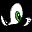
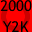

# Sonic Adventure

## VMU Saves

| Icon | Filename | VMI | VMS | Description |
|------|----------|-----|-----|-------------|
|  | `SONICADV_INT` | [v99640.vmi](v99640.vmi) | [v99640.VMS](v99640.VMS) | File 1 & 2 every character beaten. (File 1)  RARE! green hammer Amy!!!check it out...   |
|  | `SONICADV_INT` | [v79872.vmi](v79872.vmi) | [v79872.VMS](v79872.VMS) | All characters! Every story beaten! 5 weird but cool looking chaoes.The black one is in love with amy anddisrespect sonic.  |
|  | `SONICADV_INT` | [v34162.vmi](v34162.vmi) | [v34162.VMS](v34162.VMS) | Perfect Save! All Powerups, for all characters. All 130 Emblems too!  |
|  | `SONICADV_INT` | [v27701.vmi](v27701.vmi) | [v27701.VMS](v27701.VMS) | Ultimate save a hoard of chaos cho and all characters with 130 emblems.  |
|  | `SONICADV_INT` | [v26844.vmi](v26844.vmi) | [v26844.VMS](v26844.VMS) | Random voice files (Sonic, Tails, Knuckles, Amy, E-102,and Big) at the options and character select screen.  |
|  | `SONICADV_501` | [v61152.vmi](v61152.vmi) | [v61152.VMS](v61152.VMS) | Sonic in the US Dreamcast launch!!!  |
|  | `SONICADV_509` | [v17434.vmi](v17434.vmi) | [v17434.VMS](v17434.VMS) | Sonic in X-MAS add-on!!!  |
|  | `SONICADV_510` | [v95495.vmi](v95495.vmi) | [v95495.VMS](v95495.VMS) | Sonic in Y2K add-on!!!  |
|  | `SONICADV_511` | [v99030.vmi](v99030.vmi) | [v99030.VMS](v99030.VMS) | Totally NEW Twinkle park race!!!  |
|  | `SONICADV_INT` | [v15581.vmi](v15581.vmi) | [v15581.VMS](v15581.VMS) | All 130 emblems, all characters, wicked chao and super sonic  |
|  | `SONICADV_INT` | [v40042.vmi](v40042.vmi) | [v40042.VMS](v40042.VMS) | All characters, all emblems.  |
|  | `SONICADV_INT` | [v39476.vmi](v39476.vmi) | [v39476.VMS](v39476.VMS) | Perfect save. All 130 emblems and super sonic.  |
|  | `SONICADV_INT` | [v69519.vmi](v69519.vmi) | [v69519.VMS](v69519.VMS) | A good chao is within as well as an egg and some fruits.  |
|  | `SONICADV_INT` | [v8804.vmi](v8804.vmi) | [v8804.VMS](v8804.VMS) | 113 emblems all characters and 999 perfect chao  |
|  | `SONICADV_INT` | [v30883.vmi](v30883.vmi) | [v30883.VMS](v30883.VMS) | best of chao  |
|  | `ICONDATA_VMS` | [v66957.vmi](v66957.vmi) | [v66957.VMS](v66957.VMS) | A Sonic picture on your VMU.  |
|  | `SONICADV_INT` | [v39183.vmi](v39183.vmi) | [v39183.VMS](v39183.VMS) | everything beaten!  |
|  | `SONICADV_505` | [v65734.vmi](v65734.vmi) | [v65734.VMS](v65734.VMS) | SONIC IN HALLOWEEN  |
|  | `SONICADV_SYS` | [sonicadv.VMI](sonicadv.VMI) | [sonicadv.VMS](sonicadv.VMS) | Perfect Save! All Open! |
|  | `SONICADV_511` | [SASDAC.VMI](SASDAC.VMI) | [SASDAC.VMS](SASDAC.VMS) | Samba GP Extra Course! |
|  | `SONICADV_INT` | [v54092.vmi](v54092.vmi) | [v54092.VMS](v54092.VMS) | Everything unlocked. |
|  | `ICONDATA_VMS` | [v90593.vmi](v90593.vmi) | [v90593.VMS](v90593.VMS) | Sonic Adventure VMU icon. |
|  | `SONICADV_INT` | [v46264.vmi](v46264.vmi) | [v46264.VMS](v46264.VMS) | everything  opened even supersonic   enjoy  |
|  | `SONICADV_509` | [SA1_509.VMI](SA1_509.VMI) | [SA1_509.VMS](SA1_509.VMS) | Christmas Event  |
|  | `SONICADV_509` | [00000114.VMI](00000114.VMI) | [00000114.VMS](00000114.VMS) | Christmas Event (PAL version)  |
|  | `SONICADV_509` | [00000509.VMI](00000509.VMI) | [00000509.VMS](00000509.VMS) | Christmas Event (Japan version) |
|  | `SONICADV_501` | [SA1_501.VMI](SA1_501.VMI) | [SA1_501.VMS](SA1_501.VMS) | Dreamcast Launch Party  |
|  | `SONICADV_501` | [00000668.VMI](00000668.VMI) | [00000668.VMS](00000668.VMS) | Dreamcast Launch Party (PAL version) |
|  | `SONICADV_503` | [00000040.VMI](00000040.VMI) | [00000040.VMS](00000040.VMS) | Dreamcast Launch Party (Japan version) |
|  | `SONICADV_505` | [00000028.VMI](00000028.VMI) | [00000028.VMS](00000028.VMS) | Halloween Event  |
|  | `SONICADV_505` | [00000135.VMI](00000135.VMI) | [00000135.VMS](00000135.VMS) | Halloween Event (PAL version) |
|  | `SONICADV_500` | [00000763.VMI](00000763.VMI) | [00000763.VMS](00000763.VMS) | Halloween Event (Japan version)  |
|  | `SONICADV_510` | [SA1_510.VMI](SA1_510.VMI) | [SA1_510.VMS](SA1_510.VMS) | Y2K Event  |
|  | `SONICADV_510` | [00000136.VMI](00000136.VMI) | [00000136.VMS](00000136.VMS) | Y2K Event (PAL version) |
|  | `SONICADV_510` | [00000762.VMI](00000762.VMI) | [00000762.VMS](00000762.VMS) | Y2K Event (Japan version) |
|  | `SONICADV_003` | [00000760.VMI](00000760.VMI) | [00000760.VMS](00000760.VMS) | Japanese Event 1 |
|  | `SONICADV_002` | [00000761.VMI](00000761.VMI) | [00000761.VMS](00000761.VMS) | Japanese Event 2 |
|  | `SONICADV_506` | [00001333.VMI](00001333.VMI) | [00001333.VMS](00001333.VMS) | Knuckles - Mystic Ruins  |
|  | `SONICADV_504` | [00001334.VMI](00001334.VMI) | [00001334.VMS](00001334.VMS) | Sonic - Speed Highway  |
|  | `SONICADV_508` | [00001332.VMI](00001332.VMI) | [00001332.VMS](00001332.VMS) | Tails - Sand Hill  |
|  | `SONICADV_511` | [00001310.VMI](00001310.VMI) | [00001310.VMS](00001310.VMS) | Samba Grand Prix  |
|  | `SONICADV_V14` | [00000698.VMI](00000698.VMI) | [00000698.VMS](00000698.VMS) | Amy Theme |
|  | `SONICADV_V16` | [00001420.VMI](00001420.VMI) | [00001420.VMS](00001420.VMS) | Big Theme |
|  | `SONICADV_V17` | [SA1_V17.VMI](SA1_V17.VMI) | [SA1_V17.VMS](SA1_V17.VMS) | Eggman Theme |
|  | `SONICADV_V15` | [00000523.VMI](00000523.VMI) | [00000523.VMS](00000523.VMS) | Gamma Theme |
|  | `SONICADV_V13` | [SA1_V13.VMI](SA1_V13.VMI) | [SA1_V13.VMS](SA1_V13.VMS) | Knuckles Theme |
|  | `SONICADV_V19` | [00001311.VMI](00001311.VMI) | [00001311.VMS](00001311.VMS) | Random Theme |
|  | `SONICADV_V11` | [00001417.VMI](00001417.VMI) | [00001417.VMS](00001417.VMS) | Sonic Theme |
|  | `SONICADV_V12` | [SA1_V12.VMI](SA1_V12.VMI) | [SA1_V12.VMS](SA1_V12.VMS) | Tails Theme |
|  | `SONICADV_V18` | [00001295.VMI](00001295.VMI) | [00001295.VMS](00001295.VMS) | Tikal Theme |
