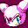

# Sonic Shuffle

## VMU Saves

| Icon | Filename | VMI | VMS | Description |
|------|----------|-----|-----|-------------|
|  | `SSHUFFLE.DAT` | [v58859.vmi](v58859.vmi) | [v58859.VMS](v58859.VMS) | all pic bought, all 8 characters, game fully beaten.  |
|  | `SSHUFFLE.DAT` | [v61627.vmi](v61627.vmi) | [v61627.VMS](v61627.VMS) | All hidden characters in VS Mode  |
|  | `SONICSHUFFLE` | [v98575.vmi](v98575.vmi) | [v98575.VMS](v98575.VMS) |  All characters unlocked.  |
|  | `SSHUFFLE.DAT` | [v20598.vmi](v20598.vmi) | [v20598.VMS](v20598.VMS) | ALL the goodies open  |
|  | `SSHUFFLE.DAT` | [SONICEX.VMI](SONICEX.VMI) | [SONICEX.VMS](SONICEX.VMS) | Sonic Shuffle Best Save |
