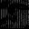

# Spec Ops: Omega Squad

## VMU Saves

| Icon | Filename | VMI | VMS | Description |
|------|----------|-----|-----|-------------|
|  | `SO-OMEGA_001` | [v68899.vmi](v68899.vmi) | [v68899.VMS](v68899.VMS) | 100% complete. I have reached highest rank of General!  |
|  | `SO-OMEGA_001` | [v66330.vmi](v66330.vmi) | [v66330.VMS](v66330.VMS) | Most of Antarctica completed  |
|  | `SO-OMEGA_001` | [v53099.vmi](v53099.vmi) | [v53099.VMS](v53099.VMS) | First level passed.  |
|  | `SO-OMEGA_001` | [v18635.vmi](v18635.vmi) | [v18635.VMS](v18635.VMS) | It is completed 100% and this is not a joke so please try it  |
|  | `SO-OMEGA_001` | [v35028.vmi](v35028.vmi) | [v35028.VMS](v35028.VMS) | About 1/2 complete. You will die many times Grasshoppa. But that's okay, you'll come back as a recruit! Worse things could happen I suppose.  |
