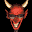

# Speed Devils

## VMU Saves

| Icon | Filename | VMI | VMS | Description |
|------|----------|-----|-----|-------------|
|  | `SPEEDDEV.DAT` | [v1227.vmi](v1227.vmi) | [v1227.VMS](v1227.VMS) | Lots of money, have Driver X carplus 3 more to chose from, Firebug,Solaro, and Twister in Class S.  |
|  | `SPEEDDEV.DAT` | [v86819.vmi](v86819.vmi) | [v86819.VMS](v86819.VMS) | Over 1.5 million and I have the Mystery Car...won from driver x, now in tha S class. Still have the first car you start with in tha game. Have 4 cars with Radar Jammer, nitro (18 shots), armor, and all tires.  |
|  | `SPEEDDEV.DAT` | [v20949.vmi](v20949.vmi) | [v20949.VMS](v20949.VMS) | Class S, Millions of$$, LA 2000 fully loaded, driver x dead!  |
|  | `SPEEDDEV.SYS` | [v95612.vmi](v95612.vmi) | [v95612.VMS](v95612.VMS) | Ultimate save all cars and tracks unlocked.Mystere unlocked in chamionship mode  |
|  | `SPEEDDEV.DAT` | [v9901.vmi](v9901.vmi) | [v9901.VMS](v9901.VMS) | data file...radar jammer,armor,nitro availiabletwo out of three cars that I have are equipped with nitroin class A not finished with class yetdo not have the banner for class c mexico track.if you want to earn the money instead of it being given |
|  | `SPEEDDEV.DAT` | [v28307.vmi](v28307.vmi) | [v28307.VMS](v28307.VMS) | All classes, more than 2,000,000, and the mystery car unlocked.  |
|  | `SPEEDDEV.DAT` | [v24161.vmi](v24161.vmi) | [v24161.VMS](v24161.VMS) | its about having it all.  |
|  | `SPEEDDEV.DAT` | [00000490.vmi](00000490.vmi) | [00000490.VMS](00000490.VMS) | Speed Devils Data File with all four classes open, all cars except Mystere purchased, level #2 acceleration, speed, brakes, nitro, armor, and radar jammer, most trophies and banners won, minimum of $500,000 cash per class.  |
