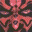

# Star Wars Episode 1: Jedi Power Battles

## VMU Saves

| Icon | Filename | VMI | VMS | Description |
|------|----------|-----|-----|-------------|
|  | `SWEP1JPB.SAV` | [v56151.vmi](v56151.vmi) | [v56151.VMS](v56151.VMS) | I am master jedi. All characters, utimate saber,training mode is complete  |
|  | `SWEP1JPB.SAV` | [v54185.vmi](v54185.vmi) | [v54185.VMS](v54185.VMS) | 89% complete in jedi mode. Ultimatesaber unlocked  |
|  | `SWEP1JPB.SAV` | [v35202.vmi](v35202.vmi) | [v35202.VMS](v35202.VMS) | Game completed with Obi-Wan Kenobi,Captain Panaka and Ki-Adi-Mundiunlocked plus training level finished.  |
|  | `SWEP1JPB.SAV` | [v39628.vmi](v39628.vmi) | [v39628.VMS](v39628.VMS) | Finished the game with Obi Wan, Qui Gon, Mace, Ki Adi. Unlocked characters.   |
|  | `SWEP1JPB.SAV` | [v95231.vmi](v95231.vmi) | [v95231.VMS](v95231.VMS) | Darth Maul unlocked, Panaka unlocked. All jedi past Swamps of Naboo.  |
|  | `SWEP1JPB.SAV` | [v54651.vmi](v54651.vmi) | [v54651.VMS](v54651.VMS) | up to last stage with Mace Windu, all combos  |
|  | `SWEP1JPB.SAV` | [v35686.vmi](v35686.vmi) | [v35686.VMS](v35686.VMS) | 1 player mode easy 97% complete. some new characters including Darth Maul and battle droid, 2 secret levels  |
|  | `SWEP1JPB.SAV` | [v58469.vmi](v58469.vmi) | [v58469.VMS](v58469.VMS) | I got just about everything. Almost a Master.  |
|  | `SWEP1JPB.SAV` | [v92210.vmi](v92210.vmi) | [v92210.VMS](v92210.VMS) | Game cleared with Obi-Wan and Qui-Gon. Last battle with Darth Maul for Adi Galia. Darth Maul(two sabers) and Captain Panaka unlocked.  |
|  | `SWEP1JPB.SAV` | [v79145.vmi](v79145.vmi) | [v79145.VMS](v79145.VMS) | Game was beat twice a lot of characters and Darth Maul.  |
|  | `SWEP1JPB.SAV` | [v72433.vmi](v72433.vmi) | [v72433.VMS](v72433.VMS) | Game completed with Obi Wan, plus training mode clear. and few newcharacters.  |
