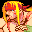

# Street Fighter 3: Double Impact

## VMU Saves

| Icon | Filename | VMI | VMS | Description |
|------|----------|-----|-----|-------------|
|  | `STF3_D_I.DAT` | [v50554.vmi](v50554.vmi) | [v50554.VMS](v50554.VMS) | Everything opened, extra options, Shin Gouki, Gill and records at parryng attack!!!  |
|  | `STF3_D_I.DAT` | [v21939.vmi](v21939.vmi) | [v21939.VMS](v21939.VMS) | Shin Akuma & Gill open hold start onAkuma & press a button for Shin Akuma.  |
|  | `STF3_D_I.DAT` | [v68968.vmi](v68968.vmi) | [v68968.VMS](v68968.VMS) | play as shin akuma and play as gill  |
|  | `STF3_D_I.DAT` | [v75558.vmi](v75558.vmi) | [v75558.VMS](v75558.VMS) | everything unlocked.shin Akuma: at selection screen go toAkuma and hold start and press anykick or punch buttons.   |
|  | `STF3_D_I.DAT` | [v88846.vmi](v88846.vmi) | [v88846.VMS](v88846.VMS) | OPENING ALL SECRETS & CHARACTERS  |
|  | `STF3_D_I.DAT` | [v33370.vmi](v33370.vmi) | [v33370.VMS](v33370.VMS) | OPTION EXTRA ALL CLEAR |
