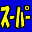

# Super Runabout SF Edition

## VMU Saves

| Icon | Filename | VMI | VMS | Description |
|------|----------|-----|-----|-------------|
|  | `SUPER_RB.SY0` | [v504.vmi](v504.vmi) | [v504.VMS](v504.VMS) | All cars&levels.  |
|  | `SUPER_RB.SY0` | [v7623.vmi](v7623.vmi) | [v7623.VMS](v7623.VMS) | Some emblems unlocked, 2 cars unlocked with police(4wheeler and a pipmobile) 3 missions unlocked also.  |
|  | `SUPER_RB.SY0` | [v45464.vmi](v45464.vmi) | [v45464.VMS](v45464.VMS) | Everything unlocked.  |
|  | `SUPER_RB.SY0` | [v30268.vmi](v30268.vmi) | [v30268.VMS](v30268.VMS) | Beat both scanerios. Got most of the cars  |
|  | `SUPER_RB.SY0` | [v41996.vmi](v41996.vmi) | [v41996.VMS](v41996.VMS) | ALL cars unlock and special missions.  |
|  | `SUPER_RB.SY2` | [v76872.vmi](v76872.vmi) | [v76872.VMS](v76872.VMS) | All missions open including some emblems.  |
|  | `SUPER_RB.SY0` | [v45837.vmi](v45837.vmi) | [v45837.VMS](v45837.VMS) | Lots of cars and most stages unlocked.  |
|  | `SUPER_RB.SY0` | [v62262.vmi](v62262.vmi) | [v62262.VMS](v62262.VMS) | All vehicles all courses unlocked including the BIM car!  |
|  | `SUPER_RB.SY0` | [v58936.vmi](v58936.vmi) | [v58936.VMS](v58936.VMS) | Everything unlocked.  |
|  | `SUPER_RB.SY0` | [SUPERRBT.VMI](SUPERRBT.VMI) | [SUPERRBT.VMS](SUPERRBT.VMS) | All unlocked. (Jap/USA) |
|  | `SUPER_RB.SY2` | [v41776.vmi](v41776.vmi) | [v41776.VMS](v41776.VMS) | All missions open and secret emblem found in normal mode.  |
