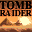

# Tomb Raider: The Last Revelation

## VMU Saves

| Icon | Filename | VMI | VMS | Description |
|------|----------|-----|-----|-------------|
|  | `TOMBRAID.003` | [v47998.vmi](v47998.vmi) | [v47998.VMS](v47998.VMS) | start in the grant temple with all weapons & inf ammo  |
|  | `TOMBRAID.002` | [v40304.vmi](v40304.vmi) | [v40304.VMS](v40304.VMS) | temp. of karnak if you have file past it please mail it to me thanks.  |
|  | `TOMBRAID.002` | [v27766.vmi](v27766.vmi) | [v27766.VMS](v27766.VMS) | Could not get rid of the ghost in the catacombs. Do not forgetto get rid of it right at the beginningby diving to his grave in the neighbouring home. Anybody hopefullyhas a savegame from the pointbefore i made this mistake? Pleeeeeeze,Plz,Plz u |
|  | `TOMBRAID.002` | [v47078.vmi](v47078.vmi) | [v47078.VMS](v47078.VMS) | THE TRAIN HOWEVER I AM STUCK CUZ THE FIRST CART DOOR IS CLOSED AND DONT KNOW HOW TO OPEN   |
|  | `TOMBRAID.000` | [v50322.vmi](v50322.vmi) | [v50322.VMS](v50322.VMS) | This starts you off at The Temple Of Seth, with infiniteeverything.  |
|  | `TOMBRAID.000` | [v99922.vmi](v99922.vmi) | [v99922.VMS](v99922.VMS) | Everything beaten with infinate everything.  All weapons.  Just start the game run foward and see the finish.  |
|  | `TOMBRAID.000` | [v22876.vmi](v22876.vmi) | [v22876.VMS](v22876.VMS) | Start at the Tomb of seth withunlimted everything ammo, life pacs,weapons,flares.  |
|  | `TOMBRAID.000` | [v25755.vmi](v25755.vmi) | [v25755.VMS](v25755.VMS) | Under the Spinx!  |
|  | `TOMBRAID.SYS` | [v33314.vmi](v33314.vmi) | [v33314.VMS](v33314.VMS) | This is system save. It unlocks all of the pictures in gallery section.  |
|  | `TOMBRAID.001` | [v76754.vmi](v76754.vmi) | [v76754.VMS](v76754.VMS) | end of game  |
|  | `TOMBRAID.SYS` | [v33314.vmi](v33314.vmi) | [v33314.VMS](v33314.VMS) | All secrets found in angkor wat level, this willhave you racing von croy to the iris using the hardest route.  |
|  | `TOMBRAID.001` | [v78133.vmi](v78133.vmi) | [v78133.VMS](v78133.VMS) | all weapons etc....  |
|  | `TOMBRAID.001` | [v99644.vmi](v99644.vmi) | [v99644.VMS](v99644.VMS) | STARS AT THE TOMB AT THE SETH WITH ALL WEAPONS,AMMOR,ETC.   |
|  | `TOMBRAID.000` | [00000001.vmi](00000001.vmi) | [00000001.VMS](00000001.VMS) | Perfect Save! Everything Unlocked! |
|  | `TOMBRAID.000` | [TOMBR4.VMI](TOMBR4.VMI) | [TOMBR4.VMS](TOMBR4.VMS) | 225 Ammo, Guns, Med packs. |
