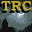

# Tomb Raider: Chronicles

## VMU Saves

| Icon | Filename | VMI | VMS | Description |
|------|----------|-----|-----|-------------|
|  | `TOMBCHRN.SYS` | [v49962.vmi](v49962.vmi) | [v49962.VMS](v49962.VMS) | system file/archivo de sistemaall secrets found, gallery unlocked.todos los secretos encontrados, galeria completa.ame y ray  |
|  | `TOMBCHRN.000` | [v17835.vmi](v17835.vmi) | [v17835.VMS](v17835.VMS) | the colosseum/coliseodirigete a la puerta grande de la izquierda y listo!!go to the gate on the left and...done!!  ame y ray  |
|  | `TOMBCHRN.000` | [v71241.vmi](v71241.vmi) | [v71241.VMS](v71241.VMS) | coliseum and you need search the altar object    |
|  | `TOMBCHRN.001` | [v53021.vmi](v53021.vmi) | [v53021.VMS](v53021.VMS) | start in the third story  |
|  | `TOMBCHRN.000` | [v89023.vmi](v89023.vmi) | [v89023.VMS](v89023.VMS) | AT RED ALERT BEFOR GAME COMPLETE  |
|  | `TOMBCHRN.000` | [v76088.vmi](v76088.vmi) | [v76088.VMS](v76088.VMS) | FASE THE 13TH FLOOR COM TODOS OS SECRETS DAS FASES ANTERIORES.   |
|  | `TOMBCHRN.004` | [v23484.vmi](v23484.vmi) | [v23484.VMS](v23484.VMS) | .tomb raider old mil tem que passarpelo monstro do rio  |
|  | `TOMBCHRN.001` | [v77644.vmi](v77644.vmi) | [v77644.VMS](v77644.VMS) | 34/36 secrets the other two are in the shoting galery the other is the pioson gas labirint at RED ALERT fase.Pal-m Version   |
|  | `TOMBCHRN.000` | [v13339.vmi](v13339.vmi) | [v13339.VMS](v13339.VMS) | Start in the submarine in the part whit you must be found the battery in positive form.  |
|  | `TOMBCHRN.000` | [v97976.vmi](v97976.vmi) | [v97976.VMS](v97976.VMS) | Save game with all galleries open, all secrets founded right in the last door of the game (with the key to open). Watch the end or start a new game without worry about secrets.  |
|  | `TOMBCHRN.001` | [v70738.vmi](v70738.vmi) | [v70738.VMS](v70738.VMS) | Secret agent LARA CROFT will take you to "THE 13th FLOOR" .  |
|  | `TOMBCHRN.001` | [v37682.vmi](v37682.vmi) | [v37682.VMS](v37682.VMS) | 31/36 secrets found in the last faze.  |
|  | `TOMBCHRN.000` | [v6657.vmi](v6657.vmi) | [v6657.VMS](v6657.VMS) | Start of the last adventure  |
|  | `TOMBCHRN.001` | [v46354.vmi](v46354.vmi) | [v46354.VMS](v46354.VMS) | The last save before the game was complete  |
|  | `TOMBCHRN.000` | [v4023.vmi](v4023.vmi) | [v4023.VMS](v4023.VMS) | level 1-10  |
|  | `TOMBCHRN.000` | [v92152.vmi](v92152.vmi) | [v92152.VMS](v92152.VMS) | All secrets opened, and start on level, Streets of Rome.  |
|  | `TOMBCHRN.000` | [v89369.vmi](v89369.vmi) | [v89369.VMS](v89369.VMS) | Here is the 2nd to 7th level.Try my favorites so far=The Colosseum and The submarine. Check out my site to allsega.com/ Thanks!  |
|  | `TOMBCHRN.000` | [TOMBR5.VMI](TOMBR5.VMI) | [TOMBR5.VMS](TOMBR5.VMS) | Unlimited Uzi, Large Med packs. |
|  | `TOMBCHRN.001` | [v60748.vmi](v60748.vmi) | [v60748.VMS](v60748.VMS) | 3rd stage almost completed  |
