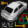

# Test Drive V-Rally

## VMU Saves

| Icon | Filename | VMI | VMS | Description |
|------|----------|-----|-----|-------------|
|  | `TDVRALLY_GAM` | [v26860.vmi](v26860.vmi) | [v26860.VMS](v26860.VMS) | Tudo detonado nesse jogasso, todas pistas, carros e um carro bonus. Voce nao vai se arrepender!  |
|  | `TDVRALLY_GAM` | [v17157.vmi](v17157.vmi) | [v17157.VMS](v17157.VMS) | this is good save.you have many cars.dar in save nimi az bazi takmil shodeh.  |
|  | `TDVRALLY_GAM` | [v28938.vmi](v28938.vmi) | [v28938.VMS](v28938.VMS) | All cars and tracks open .  |
|  | `TDVRALLY_GAM` | [v59944.vmi](v59944.vmi) | [v59944.VMS](v59944.VMS) | All cars and all championshipsopen, and you can put your nameas driver,if is not open go tothe progression screen and pushthe (a) button over the smallscreens.  |
|  | `_VRALLY2_GAM` | [v97468.vmi](v97468.vmi) | [v97468.VMS](v97468.VMS) | Everything clear: Arcade,v-rally trophy,championship,{european,world,expert}.All bonus cars and the stunning fullmotion video unlocked,{press the A button inthe last bonus car,in the progressionscreen,to see it}.  |
|  | `TDVRALLY_GAM` | [v93443.vmi](v93443.vmi) | [v93443.VMS](v93443.VMS) | All levels beaten, all cars attained. AND, as a VERY special bonus, a quite long movie of rally driver Ari Vatanen driving the Peugeot 405 T 16 up Pikes Peaks. The year is 1988. If you are a rally fan, then you LOVE this footage!!!  |
|  | `TDVRALLY_GAM` | [v91867.vmi](v91867.vmi) | [v91867.VMS](v91867.VMS) | First two levels of each mode beatenand six cars unlocked. All tracks availableto race in time trial mode.  |
