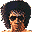

# Zombie Revenge

## VMU Saves

| Icon | Filename | VMI | VMS | Description |
|------|----------|-----|-----|-------------|
|  | `ZOMBIE_U_001` | [v30965.vmi](v30965.vmi) | [v30965.VMS](v30965.VMS) | red blood, extra option, free play mode, tranning mode  |
|  | `ZOMBIE_U_001` | [v91226.vmi](v91226.vmi) | [v91226.VMS](v91226.VMS) | TUDO LIBERADO  |
|  | `ZOMBIE_U_001` | [v26491.vmi](v26491.vmi) | [v26491.VMS](v26491.VMS) | Everything unlocked  |
|  | `ZOMBIE_U_001` | [v97447.vmi](v97447.vmi) | [v97447.VMS](v97447.VMS) | Unlimited continues & Infinite life, as well as red blood. Change blood color & # of continues in the options mode. The infinite life is for Original Mode only.  |
|  | `ZOMBIE_U_SYS` | [ZOMBIERE.VMI](ZOMBIERE.VMI) | [ZOMBIERE.VMS](ZOMBIERE.VMS) | Best Save! Everything Unlocked! |
